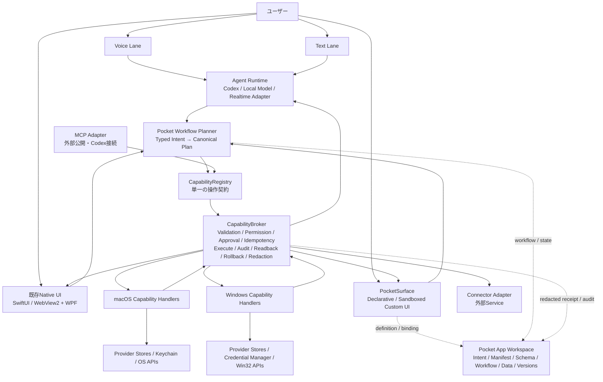
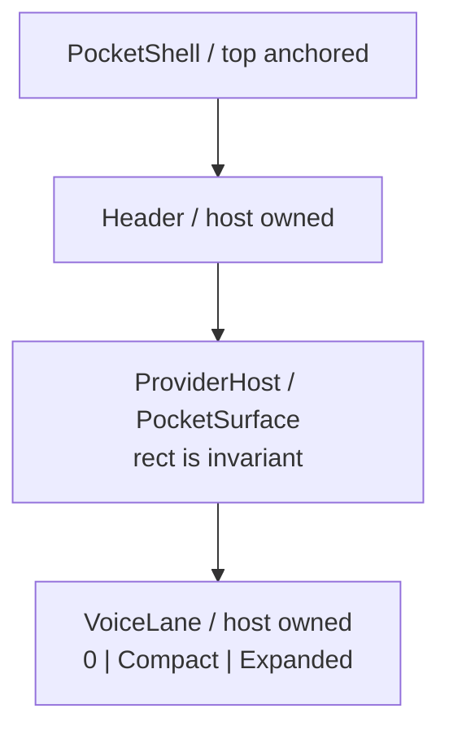
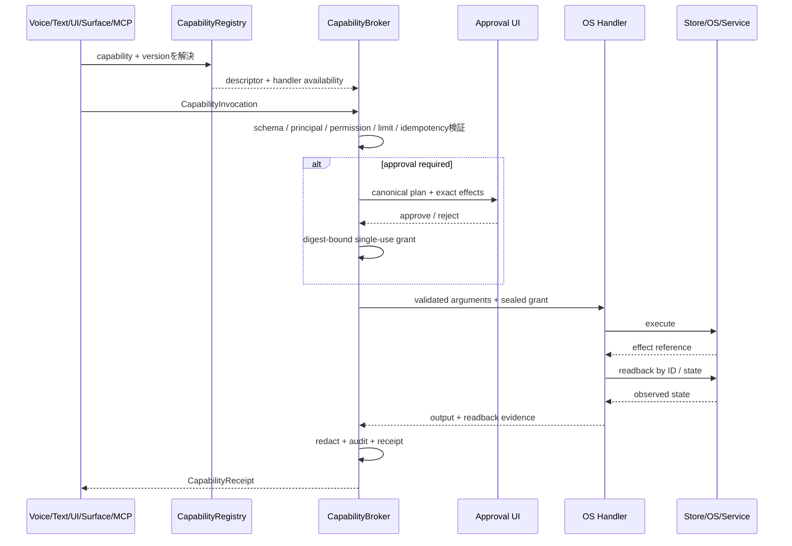
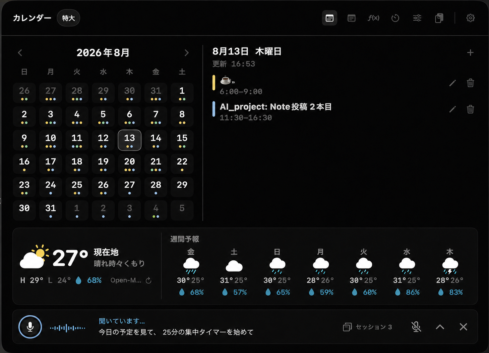
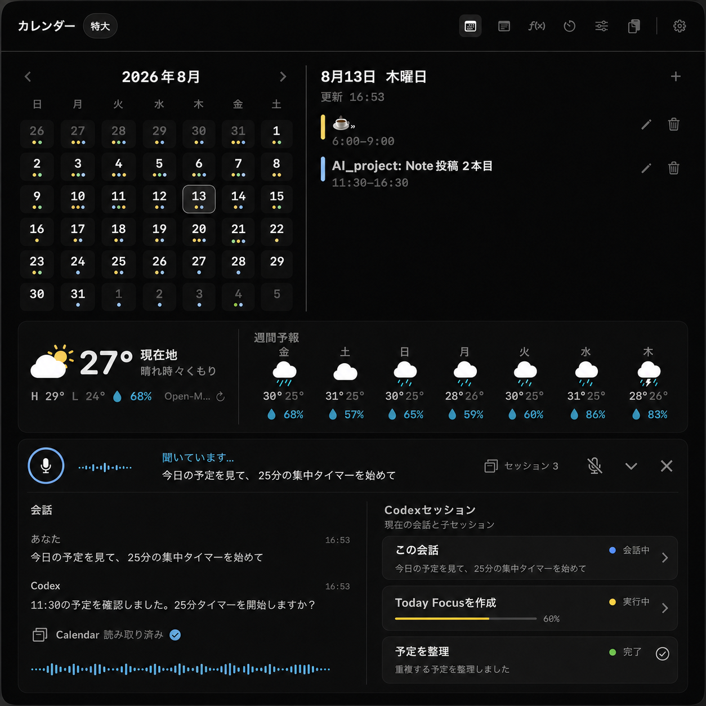
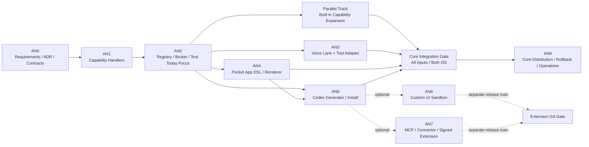

# プランニングドキュメント：HoverPocket AIネイティブ化 最終実装プラン

## 共通ルール（必読）

- 共通ルールはリポジトリルートの `AGENTS.md` を参照: `../../AGENTS.md`
- 実装前に `../../progress/progress.md` と `../requirement/requirements.md` を再読する。
- macOS / Windows は同じCapability契約とfixtureを使うが、OS固有実装と配布検証は分ける。

## 今回の追加ルール / 例外（差分だけを書く）

- この文書は実装開始前の最終計画であり、コード、branch、worktree、releaseはまだ変更しない。
- LLMは意図の翻訳・計画・UI生成を担当し、権限判定、実行、保存、readback、rollbackはHostが決定論的に担当する。
- MCPは内部正本にしない。内部正本は `CapabilityRegistry` と `CapabilityBroker` とし、MCPはAdapterとする。
- AI生成した任意Swift / C# / native libraryの即時hot installは本番要件にしない。

## 実装モード（単独 / 並列）

- 実装モード: 段階的な並列
- 判定理由（要点だけ）:
  - 分割の独立性（契約で切れる）: OK。ただし、共通JSON契約を先に単独確定する。
  - 合流コスト（共有境界の多さ）: 初期は高い。契約確定後はmacOS / Windows / Voice / Rendererで低くできる。
  - 編集衝突（同じファイル/意思決定の奪い合い）: Registry / Broker / contractsは高いので並列にしない。
- 共有境界:
  - `contracts/pocket/v1/`、Capability ID、permission、receipt、error、readbackの意味は先行PRで固定する。
  - 各OS handlerは共通fixtureが確定した後に別worktreeで並列実装する。

**作成日**: 2026-08-13

**バージョン**: 1.3

**ステータス**: 実装中・AN5-B Host生成 / preview / 管理UIのstacked PR #17は両OS CI成功。production activationはAN5-Cまでfail closed

**前バージョンからの変更**: Compact / Expandedの採用UI、下方向拡張、session card、Phase依存、Built-in Capability展開、Core GA境界を正本化した。

---

# 進捗状況

## クイックリファレンス

**現在地**: AN5-B - 固定schemaのCodex draft、Host検証 / preview / native approval、install / update / enable / disable / preserve-only remove / rollback管理UIを両OSへ実装し、stacked PR #17の両OS / 3OS contract CIが成功。実Codex processと生成Appのproduction activationはfail closed

**次のアクション**: AN5-Cで、検証済みactive packageをapp ID単位の`PocketSurfaceRegistry` / execution runtimeへ反映し、lifecycle receiptと実際の描画・実行版の一致を両OSでreadbackする。その後に実Codex confinementとAN3 Voice生成E2Eへ進む

**ブロッカー**: 実Codex生成は、AN5-Cのruntime activation readbackと、macOS sandbox helper / Windows restricted token・AppContainer相当によるローカルファイル読取り隔離を両OS実機canaryで確認するまでproduction有効化しない

**重要な決定事項**: UI / Voice / Codex / MCPはすべて `CapabilityRegistry → CapabilityBroker` を通す

### フェーズ進捗

- [x] AN0: 正本要件・ADR・共通契約
- [x] AN1: Provider操作のCapability化
- [x] AN2: Registry / BrokerとToday Focusのtext縦断
- [ ] AN3: Voice LaneとCalendar + Timer縦断
- [x] AN4: Pocket App DSLと汎用Renderer
- [ ] AN5: Codexによる生成・検証・プレビュー・導入（AN5-A lifecycle foundationとAN5-B Host pipeline / UIは実装・CI済み。AN5-C runtime activation readback、実Codex confinement、Voice E2Eが未完了）
- [ ] Parallel Track: Built-in Capability Expansion
- [ ] Core Integration Gate: 全入力経路・両OS
- [ ] AN8: Core配布、rollback、長期運用
- [ ] Optional AN6: Custom UI sandbox
- [ ] Optional AN7: MCP / Connector / 署名済み拡張

### 監査開始時のGit状態（capturedAt: 2026-08-13）

| 項目 | 現在値 | 判断 |
|---|---|---|
| checkout | `main` | 監査開始時clean。現在は本計画、requirements、progress、採用画像だけが未commit |
| `main` / `origin/main` | `61330e82f6979a47190f5e7ed03053a8cea6ec2f` | 一致 |
| worktree | mainの1件だけ | Voice用worktreeは現在ない |
| Voice branch | `origin/feature/codex-voice-lane` `374aa6a39b5860ebfb6cd944a62f08106c72cff4` | main側12 / Voice側40 commit分岐 |
| Voice PR | Draft PR #6、Open、GitHub判定MERGEABLE | 実音声E2E未達のため未マージ維持 |
| 旧AI branch | `feature/ai-native-phase1` | mainより123 commit古く、ahead 0。再利用元にしない |

---

# 1. 結論

## 1.1 実用レベルで実装可能か

実装可能である。ただし、実用レベルにするには「Codexから既存UIのbridge methodを直接呼ぶ」だけでは不十分であり、先にCapability境界、権限強制、idempotency、readback、audit、rollbackをHostへ実装する必要がある。

実用化の境界は次のとおりとする。

- 実用化できる:
  - Calendar、Timer、Sticky Notes、Clipboard、Controlsなどの既存操作を共通Capability化する。
  - Voice、テキスト、既存UI、生成Pocket Appから同じCapabilityを呼ぶ。
  - 有限DSLで、個人専用のデータ中心Pocket Appを生成、検証、導入、更新、無効化、rollbackする。
  - Custom UIを隔離WebViewで動かし、Capability token経由の操作だけ許可する。
  - CodexへローカルMCP Adapterを提供する。
- 条件付きで実用化できる:
  - Codex app-serverを使うVoice Lane。Codex導入済み・ログイン済み環境向けのopt-in / power-user機能として扱う。
  - 外部MCP / Connector。信頼済み接続先、個別権限、出力の機密性対策が必要である。
- 現時点で本番採用しない:
  - AI生成した任意native codeの即時hot install。
  - 生成WebViewからProvider Store、filesystem、shell、networkへ直接アクセスする構造。
  - LLMがapproval済みを自己申告する構造。
  - readbackなしで「完了」と返す構造。

## 1.2 推奨する最終形

長期資産を「ユーザーの意図、データ、Capability契約、監査履歴」とし、生成UIを再生成可能な投影にする。

```text
ユーザーの意図
  → Voice / Text / Native UI / PocketSurface
  → Intent Translator / Workflow Planner
  → CapabilityRegistry
  → CapabilityBroker
  → OS固有Capability Handler
  → Provider Store / OS / 外部Service
  → readback
  → 共通Receipt
  → すべての入力面へ同じ結果を表示
```

# 2. 現行要件・構想への記載状況

## 2.1 要求との対応表

| 今回の要求 | 正本要件 / 現行コード | 判定 |
|---|---|---|
| HoverPocketを開くとVoice Laneを使える | Voice branch計画とWindows基盤はあるが、正本mainとproduction UIには未接続 | 一部のみ |
| 「今日の予定」「10分タイマー」を音声操作 | Calendar read/createのみ旧AI laneにある。Timer toolと実音声はない | 未達 |
| Codexと既存UIが同じAPIを使う | macOS UIはStore直結、Windows UIはBridge直結、AIはCalendar専用Connector直結 | 未達 |
| Calendar / Timer / Clipboard / Sticky / ControlsをAI操作 | Calendar read/createのみ。ほかはAI action未定義 | 未達 |
| Codexが個人専用機能を生成・導入 | Product CompassにMCP型拡張の思想はあるが、requirementsと実装契約にはない | 構想のみ |
| manifest / schema / layout / workflow / permission / testsをデータで保持 | 現行 `PluginManifest` は表示・権限宣言・refreshのみ | 未達 |
| ユーザーが意図・設定・データ・生成Appを所有 | 既存データはApplication Support / AppDataにあるが、Pocket App workspace、export、履歴、rollbackはない | 未達 |
| 書き込み前承認 | Calendar createに実装・要件あり | 狭い範囲で達成 |
| 実行後readback | 一部Controlsは状態再取得するが、共通契約はない。macOS Calendar createはIDを返さず未達 | 未達 |
| MCP | 既存レポートとProduct Compassでは将来案。内部Adapter / 公開契約はない | 構想のみ |
| 全Provider共通の最下段Voice Lane | Voice branch計画に構想があるが、正本mainとproduction UIにはない | 構想のみ・UI未実装 |
| Compact / Expanded切り替え | Voice branchにlayout stateとWindows geometry基盤があるが、表示UIはない | 基盤のみ |
| Expandedのroot配下session card | Voice branch計画にあるが、root / child一覧modelとproduction UIはない | 構想のみ |
| Providerを潰さない下方向拡張・fullscreen禁止 | Voice branch計画にあるが、正本requirementsと現行Shellにはなかった | 今回要件化・未実装 |

## 2.2 requirementsの更新方針

現行要件は旧AI command laneがCalendar read/create中心だった。今回の最終化で旧laneを`Legacy AI command lane`として残し、別要件の`Codex Voice Lane`、共通Capability、Shell geometryを追加した。AN0のPR-Aでは、この要件とADR / JSON契約 / fixtureを同じ変更としてレビューする。

- AI Laneを「入力面」、Capability Registry / Brokerを「実行正本」と定義する。
- Voice、Text、Native UI、Pocket Appは同じCapabilityを使う。
- Pocket App DSL、PocketSurface、workspace所有権、lifecycleを要件化する。
- permission level、approval、audit、readback、rollbackを要件化する。
- Custom UIとnative extensionの安全境界を要件化する。
- Codex app-serverはopt-in adapterであり、製品のCapability runtimeではないと明記する。
- Voice LaneはHost所有の全Provider共通bottom rowとし、`disabled / compact / expanded`、Provider矩形不変、下方向拡張、fullscreen禁止を固定する。
- Legacy AI command laneとCodex Voice Laneを別namespace / 別要件として扱う。
- Compactの視覚タイトルなし、会話優先、明示toggle、Expandedの左transcript / 右root-scoped session cardsを固定する。

# 3. 現行コードの事実と差分

## 3.1 macOS

| 現行 | 根拠ファイル | 差分 |
|---|---|---|
| `PocketProvider`がmanifest、refresh、`AnyView`生成を一体化 | `Sources/HoverPocket/Providers/PocketProvider.swift` | 表示SurfaceとDomain Capabilityを分離する |
| `ProviderRegistry.builtIn`が7 Providerを固定登録 | `Sources/HoverPocket/Providers/ProviderRegistry.swift` | `PocketSurfaceRegistry`と`CapabilityRegistry`へ分ける |
| Providerの既定refreshは空snapshot | `PocketProvider.swift` / `ProviderStore.swift` | `ProviderSnapshot`をDomain APIとみなさない |
| UIが各Storeを直接操作 | `TimerView.swift`、`StickyNotesView.swift`、`GoogleCalendarPreviewView.swift`、`ControlsView.swift` | mutationから段階的にBrokerへ移す |
| `AICommandStore`が`CalendarPocketTool`へ直接依存 | `Sources/HoverPocket/State/AICommandStore.swift` | `AgentRuntime → Broker`へ置換する |
| actionはCalendar read/createのみ | `Sources/HoverPocket/Models/PocketActionModels.swift` | capability ID + schemaベースへ置換する |
| approvalは`approved: Bool` | `ApprovalGate.swift`、`CalendarPocketTool.swift` | Brokerだけが生成できるsingle-use grantへ置換する |
| AuditがAction / Result本文を丸ごと保存 | `Sources/HoverPocket/Services/AuditLog.swift` | metadata-only + redactionへ置換する |
| Calendar createがevent IDを返さない | `GoogleCalendarAPIClient.swift` | create resource取得 + ID readbackを必須にする |
| AI paletteは定義のみで現行Shellから未参照 | `AICommandPaletteView.swift` | Voice Laneと共通のAgent Surfaceへ再接続する |

`PluginManifest.requestedPermissions`は現状、manifest宣言以外で実行時強制されない。これをCapability permissionの正本として流用せず、Brokerが強制する新契約を作る。

## 3.2 Windows

| 現行 | 根拠ファイル | 差分 |
|---|---|---|
| `ProviderRegistry.CreateDefault()`が6 Providerを固定登録 | `windows/src/HoverPocket.Shell/Providers/ProviderRegistry.cs` | Surface registryとCapability registryへ分ける |
| WebViewからmethod名で`BridgeDispatcher`を呼ぶ | `Bridge/BridgeDispatcher.cs` | BridgeはUI transportに限定し、mutationをBrokerへ転送する |
| `PanelBridgeController`が全Provider handlerを直接登録 | `Bridge/PanelBridgeController.cs` | Controllerをcomposition rootにし、Broker/adapterを注入する |
| Timer / Sticky / Calendar / Controls methodは既に操作単位で存在 | 各`*BridgeController.cs` / `TimerBridgeHandlers.cs` | Capability handlerの初期adapterとして再利用する |
| 例外本文を`handler_error`でWebViewへ返す | `BridgeDispatcher.cs` | stable error code + safe messageへ変換する |
| AI LaneはCalendar Connectorへ直接依存 | `Providers/AiLane/AiLaneController.cs` | Brokerへ置換する |
| AI Lane auditは90日保持で本文を抑えている | `AiLaneAuditLog.cs` | 共通auditへ統合し、receipt / readbackを追加する |
| JS renderer mapが固定 | `windows/ui/js/app.js` | built-in rendererを残し、PocketSurface rendererを追加する |

WindowsのBridge methodはCapability候補を見つける材料として有用だが、そのままCodex / Custom UIへ公開しない。Bridgeにはorigin、principal、permission、approval binding、idempotency、readbackがないためである。

## 3.3 Voice Lane branch

再利用する。

- `CodexAppServerClient`: stdio JSONL、initialize、request相関、timeout、overload retry、server request分離。
- `CodexVoiceCoordinator`: app lifetime、状態機械、memory-only transcript ring buffer、fail-closed server request。
- disabled / compact / expanded layout state。
- fake app-serverと決定論的verifier。
- default-off settingsとCodex未導入時の安全なfailure state。

そのまま完成扱いにしない。

- production `App` / `PanelWindow` / `HoverShellController`への接続なし。
- Voice UI、microphone、WebRTC、remote audio、waveformなし。
- approval / user-input server request UIなし。
- Tool / MCP経由のHoverPocket Capability接続なし。
- 実音声E2Eなし。
- macOS実装なし。
- Voice CIは現mainのrendered WebView `--verify ui`等を含まず、main取込後の全verifier再実行が必要。
- branch計画の実測基準はWindows `codex-cli 0.144.3`だが、2026-08-13のMacでは`codex-cli 0.145.0`である。version固有schemaを流用せず、対象OSのinstalled Codexから毎回生成する。

# 4. アーキテクチャ決定記録（ADR）

## 4.1 Status

Planning accepted。アーキテクチャ方針とVoice Lane UI契約はユーザー承認済みである。独立ADRファイルとversioned contractはAN0のdocs-only PRで正本化し、merge前はコード実装を開始しない。

## 4.2 Context

HoverPocketには実用済みProviderとOS固有Storeがあるが、AI操作はCalendar専用経路であり、UI、AI、Voice、生成Appが別々の操作経路を持ち得る。これを放置すると、権限、監査、readback、OS parityが経路ごとに分岐する。

## 4.3 Decision

1. `CapabilityRegistry`を操作契約の単一正本にする。
2. すべての実行を`CapabilityBroker`へ集約する。
3. UIは`PocketSurface`、操作は`PocketCapability`として分離する。
4. 個人専用Appは有限の`Pocket App DSL`で表現する。
5. CodexはDSL / typed intent / workflow draftを生成するが、実行しない。
6. MCPは外部Adapterとし、Brokerを迂回させない。
7. SwiftとC#を直接共有せず、versioned JSON Schemaとgolden fixtureを共有する。
8. Voice LaneはHost所有の全Provider共通bottom rowとする。Compactを既定にし、ExpandedはProvider矩形とパネル上端を変えず、外枠だけを下方向へ拡大する。fullscreenとProvider overlayは採用しない。

## 4.4 Consequences

良い影響:

- Voice、Text、UI、MCP、Pocket Appで権限と結果が一致する。
- OS固有処理を維持しながら、契約と受け入れ結果を共通化できる。
- generated UIを捨てても、データとworkflowを残せる。
- failure、partial、unknownを正確に表現できる。

コスト / 制約:

- 既存UIのmutationを段階的に移行する必要がある。
- Store APIの一部をID / receipt返却へ変更する必要がある。
- DSL互換性とmigrationを長期管理する必要がある。
- arbitrary codeより表現力を意図的に制限する。

# 5. 最終アーキテクチャ



Shell内の表示構造は次で固定する。Voice Laneはarchitecture図の入力面であると同時に、Host-ownedの共有表示領域である。



重要な境界:

- UIはStoreを所有しない。表示用projectionを購読し、操作はBrokerへ送る。
- LLMは`ExecutionGrant`を作れない。
- HandlerはUIを参照しない。
- MCP / Connector / Custom UIはBroker以外へ到達できない。
- secrets、OAuth token、raw filesystem pathはAgent / Surfaceへ渡さない。

# 6. 主要コンポーネントの責務

| コンポーネント | 責務 | 持たない責務 |
|---|---|---|
| `PocketCapability` | ID、version、input/output schema、effect、permission、approval、idempotency、readback、OS handler | UI layout、LLM prompt、ユーザーAppデータ |
| `CapabilityRegistry` | descriptorと利用可能handlerの登録、version解決、platform availability、Tool metadata生成 | 承認判断、実行、Provider Store直接操作 |
| `CapabilityBroker` | schema検証、principal/origin、permission、approval、rate/size制限、idempotency、実行、readback、audit、error redaction、rollback | 自然言語解釈、UI描画 |
| `PocketApp` | intent、manifest、data schema、surface、workflow、permission要求、tests、version、migration | native entitlement、任意shell、Provider Store直接操作 |
| `PocketSurface` | 宣言的表示、typed binding、入力収集、workflow起動 | authoritative data、secret、重要計算、自由なnetwork |
| `MCP Adapter` | Registry descriptorをMCP toolへ変換し、callをBroker Invocationへ変換する | 内部正本、独自permission、Provider直接呼出し |
| `AgentRuntime` | Voice/Textをtyped intentへ翻訳、必要Capability選択、Pocket App draft生成 | approval付与、直接実行、成功判定 |
| `PocketAppManager` | validate、tests、preview、permission diff、atomic install、activate、disable、update、rollback、remove | arbitrary native build / signing |

# 7. 共通契約

## 7.1 ファイル正本

```text
contracts/pocket/v1/
├── capability-descriptor.schema.json
├── invocation.schema.json
├── execution-plan.schema.json
├── approval-request.schema.json
├── receipt.schema.json
├── error.schema.json
├── voice-lane-state.schema.json
├── agent-session-summary.schema.json
├── voice-transcript-event.schema.json
├── pocket-app.schema.json
├── pocket-surface.schema.json
├── pocket-workflow.schema.json
└── fixtures/
    ├── valid/
    ├── invalid/
    └── golden/
```

共通規約:

- 日時: RFC 3339。
- timezone: IANA ID。
- duration: integer seconds。
- entity ID: opaque string。UUIDを要求するCapabilityだけformatを固定する。
- schemaは`additionalProperties: false`を既定とする。
- breaking changeはCapability major versionを上げる。
- platform差は同じIDを維持し、`availability`とstable error codeで表す。

## 7.2 主要型

```typescript
type InvocationOrigin =
  | "native_ui"
  | "voice"
  | "text"
  | "pocket_surface"
  | "mcp"
  | "connector";

interface CapabilityInvocation {
  invocationId: string;
  capabilityId: string;
  capabilityVersion: number;
  origin: InvocationOrigin;
  principal: {
    userId: string;
    pocketAppId?: string;
    agentSessionId?: string;
  };
  arguments: unknown;
  idempotencyKey: string;
  traceId: string;
  createdAt: string;
}

interface CapabilityReceipt {
  invocationId: string;
  status: "succeeded" | "rejected" | "failed" | "partial" | "unknown";
  capability: { id: string; version: number };
  output?: unknown;
  readback: {
    status: "verified" | "mismatch" | "unavailable";
    strategy: string;
    observedAt?: string;
    evidenceDigest?: string;
  };
  rollback?: {
    available: boolean;
    status?: "not_requested" | "succeeded" | "failed";
  };
  auditEntryId: string;
  safeError?: { code: string; retryable: boolean; messageKey: string };
}

type VoiceLaneMode = "disabled" | "compact" | "expanded";
type VoiceActivity =
  | "idle"
  | "listening"
  | "thinking"
  | "speaking"
  | "waiting_for_approval"
  | "reconnecting"
  | "failed";

interface VoiceLaneState {
  mode: VoiceLaneMode;
  connection: "disconnected" | "connecting" | "connected" | "recovering";
  activity: VoiceActivity;
  muted: boolean;
  transcriptPreview?: string;
  rootSessionId?: string;
  visibleSessionCount: number;
  sessions: AgentSessionSummary[];
}

interface AgentSessionSummary {
  sessionId: string;
  rootSessionId: string;
  parentSessionId?: string;
  title: string;
  status:
    | "queued"
    | "running"
    | "waiting_for_user"
    | "succeeded"
    | "failed"
    | "cancelled";
  safeSummary?: string;
  progress?: { completed: number; total: number };
  updatedAt: string;
  navigation: "lane_detail" | "unavailable";
}
```

Swift / C#側では上記JSONをdecodeする型を持つ。Handlerへ渡す`ExecutionGrant`だけはJSON公開せず、Brokerが生成するsealedなOS内部型にする。

Voice / session契約へraw command、filesystem path、token、全文transcriptを入れない。`sessions`は現在の`rootSessionId`と同じrootを持つcurrent / child / descendantだけに限定し、別rootや全履歴を混ぜない。

## 7.3 Capability descriptor例

```json
{
  "$schema": "hoverpocket://schemas/capability-descriptor/v1",
  "id": "timer.countdown.start",
  "version": 1,
  "titleKey": "capability.timer.countdown.start",
  "effect": "reversible_local_write",
  "permissions": ["timer.write"],
  "approvalPolicy": "broker_policy",
  "idempotency": "required",
  "limits": { "timeoutMs": 3000, "maxPayloadBytes": 4096 },
  "inputSchema": {
    "type": "object",
    "required": ["durationSeconds"],
    "properties": {
      "durationSeconds": { "type": "integer", "minimum": 1, "maximum": 86400 },
      "title": { "type": "string", "minLength": 1, "maxLength": 80, "default": "Timer" },
      "sourceRef": { "type": ["string", "null"], "maxLength": 256 }
    },
    "additionalProperties": false
  },
  "outputSchema": {
    "type": "object",
    "required": ["timerId", "state", "endAt"],
    "properties": {
      "timerId": { "type": "string", "format": "uuid" },
      "state": { "enum": ["running", "paused"] },
      "endAt": { "type": "string", "format": "date-time" }
    },
    "additionalProperties": false
  },
  "readback": {
    "strategy": "capability_query",
    "capabilityId": "timer.countdown.get",
    "match": ["timerId", "state", "endAt"]
  }
}
```

# 8. Pocket App DSL

## 8.1 ユーザー所有workspace

推奨は、初回セットアップでユーザーが確認・変更できるworkspace folderを選び、次を正本として保存する形である。default locationの最終決定は未決定事項に残す。

```text
HoverPocket Workspace/
├── apps/
│   └── local.shotaro.today-focus/
│       ├── manifest.json
│       ├── intent.md
│       ├── data.schema.json
│       ├── surfaces/main.surface.json
│       ├── workflows/start-focus.workflow.json
│       ├── permissions.json
│       ├── tests/
│       └── assets/
├── data/
│   └── local.shotaro.today-focus/
├── versions/
│   └── local.shotaro.today-focus/
├── receipts/
└── audit/
```

- App定義とユーザーデータを物理的に分ける。
- App削除時は、データを保持 / export / 削除から選べる。
- Pocket App Managerからintent、設定、permission、data location、active versionを確認・変更でき、raw workspaceも開ける。
- secretはworkspaceへ置かず、macOS Keychain / Windows Credential Managerへ置く。
- runtime cache / search indexはApplication Support / AppDataやSQLiteを使ってよい。
- workspaceはinspectable / exportableであり、storage implementationをすべてplain JSONへ限定しない。

## 8.2 Today Focus manifest例

```json
{
  "$schema": "hoverpocket://schemas/pocket-app/v1",
  "apiVersion": "hoverpocket.app/v1",
  "id": "local.shotaro.today-focus",
  "name": "Today Focus Pocket",
  "version": "1.0.0",
  "minHostVersion": "1.0.0",
  "intent": "intent.md",
  "state": {
    "schema": "data.schema.json",
    "store": "user-data://local.shotaro.today-focus"
  },
  "surfaces": [
    { "id": "main", "kind": "declarative", "source": "surfaces/main.surface.json" }
  ],
  "requestedCapabilities": [
    { "id": "calendar.events.list", "version": 1, "scope": { "range": "today" } },
    { "id": "timer.countdown.start", "version": 1 },
    { "id": "timer.countdown.get", "version": 1 },
    { "id": "sticky.note.upsert", "version": 1, "scope": { "namespace": "today-focus" } },
    { "id": "sticky.note.get", "version": 1, "scope": { "namespace": "today-focus" } }
  ],
  "workflows": {
    "startFocus": "workflows/start-focus.workflow.json"
  },
  "tests": [
    "tests/calendar-read.json",
    "tests/start-focus-approved.json",
    "tests/start-focus-rejected.json",
    "tests/start-focus-idempotent-replay.json"
  ]
}
```

`requestedCapabilities`は要求宣言であり、権限付与ではない。AppはRegistry側のriskやapproval policyを緩和できない。

## 8.3 data schema例

```json
{
  "$schema": "https://json-schema.org/draft/2020-12/schema",
  "type": "object",
  "required": ["date", "purpose"],
  "properties": {
    "date": { "type": "string", "format": "date" },
    "selectedEventRef": { "type": ["string", "null"], "maxLength": 256 },
    "purpose": { "type": "string", "maxLength": 1000 },
    "timerRef": { "type": ["string", "null"] },
    "stickyNoteRef": { "type": ["string", "null"] }
  },
  "additionalProperties": false
}
```

Calendar予定、Timer状態、Sticky本文のauthoritative stateをSurfaceへ複製しない。ここには参照とユーザーの長期意図だけを保持する。

## 8.4 PocketSurface例

```json
{
  "$schema": "hoverpocket://schemas/pocket-surface/v1",
  "id": "main",
  "root": {
    "type": "stack",
    "axis": "vertical",
    "children": [
      { "type": "text", "style": "title", "value": "今日のフォーカス" },
      {
        "type": "calendarEventPicker",
        "items": { "query": "calendar.events.list@1", "arguments": { "range": "today" } },
        "selection": "$state.selectedEventRef"
      },
      { "type": "durationPicker", "value": "$input.durationSeconds", "min": 60, "max": 14400 },
      { "type": "textField", "label": "今日の目的", "value": "$input.purpose", "maxLength": 1000 },
      { "type": "button", "label": "フォーカスを開始", "workflow": "startFocus" }
    ]
  }
}
```

v1 component grammarは有限にする。`stack`、`grid`、`text`、`image`、`button`、`textField`、`toggle`、`picker`、domain picker、status、receipt程度から始める。

## 8.5 workflow例

```json
{
  "$schema": "hoverpocket://schemas/pocket-workflow/v1",
  "id": "startFocus",
  "inputs": {
    "calendarEventRef": "string",
    "durationSeconds": "integer",
    "purpose": "string"
  },
  "approval": { "mode": "before_writes", "group": "all_writes" },
  "steps": [
    {
      "id": "startTimer",
      "use": "timer.countdown.start@1",
      "with": {
        "durationSeconds": "$input.durationSeconds",
        "title": "$context.selectedEvent.title",
        "sourceRef": "$input.calendarEventRef"
      }
    },
    {
      "id": "savePurpose",
      "use": "sticky.note.upsert@1",
      "with": {
        "stableKey": "today-focus:$context.today",
        "title": "今日の目的",
        "body": "$input.purpose",
        "color": "yellow"
      }
    }
  ],
  "onPartialFailure": {
    "mode": "compensate_if_available",
    "presentReceipt": true
  }
}
```

DSL v1に含めないもの:

- 任意JavaScript / Swift / C# / shell。
- 自由なfilesystem path。
- 自由なHTTP request。
- 無制限loop / recursion。
- dynamic eval / dynamic import。
- App独自のapproval緩和。

# 9. Today Focus Pocket 縦断実装

## 9.1 受け入れ体験

1. ユーザーがHoverPocketを開く。
2. Voice、Text、既存Calendar UI、Today Focus Surfaceのいずれかから「今日の予定に合わせて集中を始めたい」と入力する。
3. `calendar.events.list@1`が今日の予定を読む。
4. ユーザーが予定を選び、durationと目的を補完する。
5. BrokerがTimer開始とSticky保存を1枚のwrite planとして提示する。
6. 却下時は書き込みゼロ。
7. 承認時はsingle-use approval grantを使い、TimerとStickyを実行する。
8. `timer.countdown.get@1`と`sticky.note.get@1`で別経路readbackする。
9. 同じworkflow receiptをVoice、Text、Surface、既存UIへ返す。

## 9.2 Canonical plan

すべての入力面は最終的に同じcanonical planを生成する。

```text
calendar.events.list@1 (read)
  → selected opaque event ref
  → approval group
     ├─ timer.countdown.start@1
     └─ sticky.note.upsert@1
  → timer.countdown.get@1
  → sticky.note.get@1
  → WorkflowReceipt
```

## 9.3 部分失敗

複数Store / 外部Serviceをまたぐため、偽のtransaction成功を作らない。

- 実行前に全stepのschema、availability、permission、容量、上限をpreflightする。
- 各stepは固有idempotency keyを持つ。
- 成功済みstepと失敗stepをreceiptへ残す。
- rollback handlerがある場合だけ補償する。
- rollback失敗時は`partial`を維持し、ユーザーに残った状態を表示する。
- 状態不明の非冪等operationを自動再送しない。

## 9.4 Today Focusだけでは不足するVoice受け入れ

ユーザー体験には「今日14時に打ち合わせを追加」も含まれるため、Today Focusとは別に`calendar.event.create@1`のVoice E2EをAN3 gateへ入れる。

- title、calendar、start、end、timezoneを承認画面に表示する。
- 承認前にPOSTしない。
- POST応答からevent IDを取得する。
- 同IDをGETまたは強制再取得して一致確認する。
- retry時に重複予定を作らない。

# 10. 権限レベルと承認ルール

| Level | 種別 | 例 | 既定ルール |
|---|---|---|---|
| L0 | public / pure | calculator、renderer-only計算、App metadata | 承認なし |
| L1 | private read | Calendar予定一覧、Sticky参照、Timer状態 | 初回permission grant。per-call承認なし。最小データだけAgentへ渡す |
| L2 | reversible local write | Timer開始/停止、Sticky upsert、UI設定 | 明示指示またはApp grant。複合workflowは実行前group承認 |
| L3 | external / identity write | Calendar create/update、外部Connector write | exact argumentsを毎回承認 |
| L4 | destructive / sensitive / broad | Calendar delete、Clipboard clear、データ削除、permission増加、network追加 | 毎回強い承認。scopeとrollback可否を表示 |
| L5 | native authority | entitlement、任意code、library、shell、署名済みextension | runtime導入不可。worktree、review、sign、通常release |

追加ルール:

- Clipboard本文をモデルへ渡すpermissionは、OS上のclipboard readとは分けて `clipboard.content.share_with_agent` とする。
- Microphone permissionとtranscript/model送信permissionを分ける。
- Pocket App updateでpermissionが増える場合は再承認する。
- approvalはcapability ID、version、canonical arguments digest、principal、App version、期限、nonceへbindする。
- approval tokenはsingle-use、短時間有効、Broker内だけで保持する。
- Native UIもAIもrisk判定を迂回しない。ただし、連続slider等はBrokerが明示的に許可したinteractive grantを使う。

# 11. CapabilityBroker 実行手順



Brokerの必須機能:

- descriptor / schema / version validation。
- permission grantとapproval policy。
- principal / origin / App version binding。
- timeout、payload size、call rate、concurrency limit。
- idempotency ledger。
- cancellation。
- execution / readback / rollback orchestration。
- metadata-only audit。
- safe error mapping。
- receipt保存とユーザー向け履歴。

# 12. 監査ログとreadback

## 12.1 Audit entry

保存する:

- `auditEntryId`、timestamp、traceId、invocationId。
- origin、principalの匿名化ID、Pocket App ID/version。
- capability ID/version、effect level。
- permission / approval decision、approval policy。
- input digest。raw inputは保存しない。
- status、duration、retry count、idempotency replay有無。
- readback status、evidence digest。
- stable safe error code。

既定で保存しない:

- raw voice transcript。
- source prompt。
- Calendar title / notes / location。
- Sticky本文。
- Clipboard本文 / image。
- OAuth token、API key、Authorization header。
- raw exception、filesystem path、process command line。

## 12.2 readback policy

Capability descriptorへ次のいずれかを必須指定する。

- `entity_get_by_id`: Calendar / Stickyなど。
- `same_store_snapshot`: Timer状態など。
- `os_state`: volume / brightness / mediaなど。
- `content_digest`: user-owned file / App packageなど。
- `none`: pure actionだけ。副作用Capabilityには原則不可。

成功条件:

- 実行API成功だけでは`status=succeeded`にしない。
- readback一致で初めて`succeeded`。
- mismatchは`failed`または`partial`。
- timeoutやreadback不能で副作用有無が不明なら`unknown`。
- `unknown`を自動再送しない。

ユーザーはSettingsの「AI・自動操作履歴」からreceiptを確認・削除・exportできるようにする。

# 13. 生成UI sandbox

## 13.1 Declarative PocketSurface

AN4のdeclarative Surfaceはnative rendererが有限component treeを描画するため、任意codeを実行しない。これを既定かつ推奨経路とする。

- macOS: SwiftUI renderer。
- Windows: existing WebView2 DOM renderer。重要approvalはWPF/native overlayを利用できる。
- state bindingはHost-managed store経由。
- actionはworkflow IDまたはCapability IDだけを参照する。
- URL、path、secretをbindingへ出さない。

## 13.2 Custom UI

DSLで不足が実測された後のAN6で導入する。

共通制約:

- App/versionごとのisolated origin。
- Store、filesystem、shell、native bridge、Credential Storeへ直接アクセス不可。
- network既定拒否。
- popup、download、top navigation、external protocol禁止。
- `eval`、dynamic import、WebSocket、service worker禁止。
- Capability tokenはApp ID、version、surface ID、action、scope、expiry、nonceへbindする。
- token自体をpage JavaScriptへ渡さず、isolated host bridgeが保持する。
- payload、call rate、memory、CPU、timeoutを制限する。
- errorはsafe codeだけ返す。

推奨CSP:

```text
default-src 'none';
script-src 'self';
style-src 'self';
img-src 'self' data:;
font-src 'self';
connect-src 'none';
media-src 'none';
frame-src 'none';
object-src 'none';
base-uri 'none';
form-action 'none';
```

Windows:

- WebView2はAppごとのvirtual host / profile / user-data境界を持つ。
- `AreDevToolsEnabled`、default context menu、host object、untrusted navigationを無効化する。
- 現行`BridgeDispatcher`をそのまま公開せず、許可済みmessage envelopeだけをBroker adapterへ渡す。
- Custom UIのmicrophone permissionは常に拒否する。
- transcriptはtext nodeで描画し、remote textを`innerHTML`へ渡さない。

Voice Laneは生成Custom UIではなくHost-owned trusted surfaceである。WindowsでWebView2を使う場合はCustom UIと異なる専用profile / exact origin（候補: `https://voice.hoverpocket.local`）へ隔離し、feature enabled、Voice Lane可視、明示的user gesture、Microphoneの全条件を満たす場合だけHost permission handlerが許可する。正式originはAN0のsecurity fixtureで固定する。

macOS:

- `WKWebView`をAppごとのnon-persistentまたは分離data storeで動かす。
- local scheme handlerから署名 / hash確認済みassetだけ配信する。
- `WKScriptMessageHandler`はBroker adapterの限定messageだけ受ける。

# 14. Pocket App lifecycle

## 14.1 導入

```text
Codex draft
  → staging directory
  → JSON Schema validation
  → reference / type / permission validation
  → static workflow analysis
  → deterministic tests
  → preview
  → permission diff表示
  → user approval
  → atomic version snapshot
  → activate
  → active version readback
```

live workspaceをCodexへ直接書き換えさせない。

## 14.2 更新

- 旧版と新版のmanifest、schema、permission、workflow、surface diffを表示する。
- data migrationはdeclarative migrationだけ許可する。
- migration前にdata snapshotを作る。
- permission増加、Connector追加、Custom UI化は再承認する。
- activate後にversion、manifest digest、data migration結果をreadbackする。

## 14.3 無効化

- 実行とSurface表示を停止する。
- user data、versions、receiptsは保持する。
- permission grantをsuspendする。
- 再有効化時はversion / permission互換を再検査する。

## 14.4 削除

ユーザーへ次を分けて提示する。

1. Appだけ削除し、データを保持。
2. Appとデータをexport後に削除。
3. App、データ、履歴を削除。

秘密情報はCredential Store側のconnector revokeを別項目として確認する。自動で外部OAuth grantまで削除したと推測しない。

## 14.5 rollback

- active pointerを以前の検証済みversionへatomicに切り替える。
- permissionは旧版のsubsetへ戻す。新規grantを残さない。
- data schemaが戻せない場合は、旧App + compatible migrated snapshotの組を復元する。
- rollback後にactive version、manifest digest、data versionをreadbackする。
- 一般ユーザーにはGitではなく「以前の版へ戻す」と表示する。

# 15. macOS / Windows共通契約とOS固有実装

| 層 | 共通 | macOS | Windows |
|---|---|---|---|
| Contract | JSON Schema、ID、version、permission、effect、receipt、error、fixtures | Swift Codable mapping | C# System.Text.Json mapping |
| Registry | descriptor意味とavailability | Swift actor / composition root | .NET service / DI composition root |
| Broker | policy、approval、idempotency、readback semantics | actor + MainActor handler bridge | async service + WPF dispatcher bridge |
| Calendar | list/get/create/update/delete契約 | GoogleCalendarStore / API client adapter、Keychain | CalendarStore / API client adapter、Credential Manager |
| Timer | start/get/pause/resume/stop契約 | TimerStore adapter | TimerStore adapter |
| Sticky | upsert/get/archive/delete契約 | StickyNotesStore repository adapter | StickyNotesStore adapter |
| Controls | volume/brightness/media契約 | CoreAudio / display / MediaRemote | Core Audio / DDC-CI / GSMTC |
| Native UI | 同じInvocation / Receipt | SwiftUI | WebView2 + WPF |
| Declarative Surface | 同じPocketSurface JSON | SwiftUI renderer | DOM renderer |
| Custom UI | 同じmessage envelope / token semantics | isolated WKWebView | isolated WebView2 |
| Voice | 同じVoiceSessionAdapter / Agent Runtime interface | AVAudio / WebRTC実装またはAPI adapter | Voice branch WebView2 / app-server資産 |
| Shell geometry | `disabled / compact / expanded`、top anchor / Provider rect不変、下方向拡張 | SwiftUI shell row + NSPanel resize | DOM shell row + WPF window geometry |
| Voice Lane UI | 同じsemantic state、明示toggle、Compact / Expanded契約 | SwiftUI Host surface | trusted WebView2 Host surface |
| Session cards | 共通`AgentSessionSummary`、current root scope | SwiftUI 2-column renderer | DOM 2-column renderer |
| Approval / Receipt | Broker所有・生成UIから偽装不可 | Host native surface | WPF / Host-owned trusted surface |
| 小画面fallback | Providerを縮めず、Expanded不可ならCompact維持 | visible frameで判定 | work area / mixed DPIで判定 |
| close / mute / background | closeはmute + detach、muteはtask非cancel | app-lifetime coordinator | app-lifetime coordinator |

共通化するのは契約と期待結果であり、OS API driverを無理に共通runtimeへ移さない。

# 16. 現行コードからの移行方法

## 16.1 基本戦略

Strangler patternで移行する。

1. 現行StoreとUIを残す。
2. Storeを包むCapability handlerを追加する。
3. Broker経路と旧UI経路のparity testを作る。
4. 既存UIのmutationを1操作ずつBrokerへ切り替える。
5. 表示は既存Store projectionを購読し続ける。
6. 全consumer移行後に直結methodをinternal化 / 削除する。

feature flagで旧経路と新経路を二重実行しない。shadow modeはread-only comparisonだけにする。

## 16.2 macOS具体移行

- `PocketProvider`はすぐ削除せず、`LegacyNativeSurface` adapterとして残す。
- 新しい`PocketSurfaceRegistry`がnative built-inとgenerated Surfaceを列挙する。
- `CapabilityRegistry`は別に作る。
- `AICommandStore`を`AgentRuntimeStore`へ置換し、Calendar direct dependencyをなくす。
- `ApprovalGate` / `AuditLog` / `CalendarPocketTool`の責務をBrokerへ吸収する。
- Calendar API create/updateはresource / IDを返す。
- Timer startは新規ID / RunningTimerを返す。
- Stickyにatomic create / stableKey upsert / get by IDを追加する。
- Controlsはasync driver + OS readbackへ分離する。

UI mutation移行順:

1. Timer。
2. Sticky Notes。
3. Calendar。
4. Calculator。
5. Controls。
6. Clipboard。
7. MirrorはAI Tool対象外のまま、Surface permissionだけ分離する。

## 16.3 Windows具体移行

- `PanelBridgeController`をcomposition rootとしてBrokerを生成・注入する。
- `TimerBridgeHandlers`、`StickyBridgeController`、`CalendarBridgeController`、`ControlsBridgeController`を初期handler adapterとして包む。
- WebView methodは互換維持しつつ、mutation handler内部でBrokerへInvocationを送る。
- read-only snapshot methodは段階的にquery Capabilityへ寄せる。
- `BridgeDispatcher`のraw exceptionをstable safe errorへ変換する。
- `AiLaneController`のCalendar ConnectorをBroker adapterへ置換する。
- `providerRenderers`のbuilt-in mapを残し、generated Surface rendererを追加する。

# 17. Voice Lane統合

## 17.1 境界

VoiceはCapability runtimeではなく入力Adapterである。

Voice LaneはProviderではなくHost所有のShell rowである。最終Shell構造を次で固定する。

```text
PocketShell（上端固定）
├── Header（不変）
├── ProviderHost / PocketSurface（位置・高さ不変）
└── VoiceLane（0 / Compact / Expanded。常に最下段）
```

生成Pocket Appが描画できるのは`PocketSurface`だけであり、Header、Voice Lane、承認、receiptはHostが所有する。

```text
microphone / text transcript
  → VoiceSessionAdapter
  → AgentRuntime
  → canonical intent / plan
  → Registry / Broker
  → Receipt
  → Voice response + visual receipt
```

## 17.2 確定Voice Lane UI契約

文章化した本節とrequirementsを実装の正本とし、採用画像は視覚的受け入れ基準として使う。画像をピクセル完全一致の仕様にはしない。

### Compact（既定）



- Voice機能全体はdefault-off。明示enable後はCompactを全Provider共通の最下段へ表示する。自動listenは別opt-inにする。
- 視覚的な`Codex Voice`タイトルは置かない。ただしVoice Laneのaccessibility region labelは持つ。
- 左からマイク、短いbounded waveform、状態と直近会話1〜2行を置く。会話欄を主領域とし、波形は会話幅より小さく固定する。
- 右側に現在root配下の表示session数、mute、明示expand control、Voice session終了を置く。
- レーン面全体clickでは展開しない。expand / collapse controlだけがmodeを変更する。
- approval待ちと実行後receiptはHost-owned領域へ表示し、生成Surfaceが偽装できないようにする。

### Expanded



- パネル上端、幅、Header、ProviderHostの位置と高さを変えず、外枠の下端だけを下へ伸ばす。上側を圧縮、被覆、再配置しない。
- 左列は現在root会話のtranscript、tool receipt、approval。右列は現在rootと同じrootを持つcurrent / child / descendant session cardsとする。
- 左列を会話の主領域、右列を補助領域とする。実装開始値はおおむね`62:38`とし、両列を独立scrollさせる。
- Smallでも右列を自動で隠さない。card情報量を減らし、列内scrollする。
- fullscreenのstate / route / button、別Provider化、overlay drawerを実装しない。
- 画面高さがExpanded最低寸法に足りない場合はProviderを縮めずCompactを維持し、理由を表示する。

Geometry式:

```text
HeaderRect(disabled) == HeaderRect(compact) == HeaderRect(expanded)
ProviderHostRect(disabled) == ProviderHostRect(compact) == ProviderHostRect(expanded)
ShellTop(disabled) == ShellTop(compact) == ShellTop(expanded)
BaselinePanelHeight = HeaderHeight + ProviderHostHeight
ShellTotalHeight = BaselinePanelHeight + VoiceLaneHeight(mode, panelSize)
```

既存の`520×372`等はVoice無効時の`BaselinePanel`寸法である。現行Windowsコードの`ProviderHeight`はlegacy名称で`BaselinePanelHeight`を指すため、Header 54を再加算しない。

Windows Voice branchの`Compact=64`、`Expanded Small/Medium/Large=190/220/250`は再利用候補であり、確定値ではない。AN0でWindows S/M/LとmacOS S/M/L/XLのdesign token / golden geometry fixtureを固定する。

## 17.3 セッションカードとlifecycle契約

- 表示対象は「この会話」と、現在の`rootSessionId`から派生したchild / descendantだけである。一般的な全過去会話browserではない。
- session数は現在会話を含む表示card数とする。
- cardはtitle、状態、経過時間または更新時刻、進捗、直近の安全な要約を表示する。raw command、filesystem path、全文transcriptを含めない。
- card clickの初期動作はLane内詳細表示とする。ChatGPT / Codex Desktopへのdirect navigationは対応APIを対象OSで実測した後だけ採用する。
- 外部遷移不能時の`codex resume <threadId>`は、明示確認後に起動する代替候補とし、初回必須要件にしない。
- 全履歴browser、New、Delete、Archive管理は初回対象外である。
- HoverPocket auditへraw transcriptを保存しない。Host transcriptはmemory-only bounded bufferとする。Adapter側が会話を永続化する場合は保存場所、保持期間、削除方法をSettingsへ開示する。
- muteは音声入出力だけを止める。hover closeはmute + UI detachとし、root / child taskをcancelしない。Voice session終了ボタンはRealtime音声sessionだけを終了し、root / child taskを継続する。task cancelはsession card上の別操作として対象・影響を表示し、別承認を求める。

## 17.4 推奨provider abstraction

```typescript
interface VoiceSessionAdapter {
  start(context: VoiceContext): Promise<VoiceSession>;
  sendText(text: string): Promise<void>;
  setMuted(muted: boolean): Promise<void>;
  onTranscript(handler: TranscriptHandler): Unsubscribe;
  onToolIntent(handler: ToolIntentHandler): Unsubscribe;
  close(): Promise<void>;
}
```

- `CodexAppServerVoiceAdapter`: existing Voice branch資産を利用するpower-user path。
- `OpenAIRealtimeVoiceAdapter`: 一般配布候補。API / BYOK / product billing判断が必要。
- `TextOnlyAgentAdapter`: audioが使えないときも同じCapability体験を維持する。

OpenAI公式上、Codex app-serverはrich client向けにauth、history、approval、streamed eventを扱える一方、app-server command / WebSocket transportはexperimentalでproduction support外と明記されている。したがって、Capability層をapp-server protocolへ固定しない。

OpenAI Realtimeはbrowser / mobile audioにWebRTCを推奨し、tool callを扱えるため、一般配布のVoice候補として並行評価する。ただし、課金、鍵管理、privacy、macOS/Windows実機品質をAN3で測る。

## 17.5 CodexとCapabilityの接続

AN3で最小のlocal `MCP Adapter`を実装する。

- Registry descriptorからallowlisted MCP tool metadataを生成する。
- tool callはlocal authenticated IPCでBrokerへ送る。
- Broker receiptをMCP resultへ変換する。
- Codex側approvalとHoverPocket Broker approvalを混同しない。最終permission authorityはBrokerである。
- raw Provider Store、BridgeDispatcher、filesystem pathをMCPへ公開しない。

AN7の「MCP ecosystem」は別物である。AN3はHoverPocket built-in CapabilityをCodexへ見せるlocal adapterだけ、AN7は第三者MCP / Connector / signed extensionを扱う。

## 17.6 Voice branch取込条件

- current mainを取込み、12/40分岐を解消する。
- current Windows全verifier + Voice verifier + rendered WebView verifierを実行する。
- branch planの「計画のみ」とprogressの「foundation implemented」の矛盾を直す。
- Windows対象機で現行Codex schemaを再生成する。
- `ExperimentalApi`の既定をfalseにし、installed schema / account / capability確認後のopt-in時だけ有効化する。
- signed-out、requestingPermission、negotiating、stopping、recoverable failure、blocked failureを状態機械へ追加する。
- app-server crash検知とbounded restart / backoffを追加する。
- microphone、WebRTC SDP、remote audio、mute、reconnectを実測する。
- approval / user-input server requestをBroker UIへ接続する。
- Today FocusとCalendar createの実音声E2Eを通す。
- macOSは共通state machine / contractを使い、別のOS実装を作る。

# 18. Capability初期inventory

| Domain | 初期Capability | Effect / permission | 優先 |
|---|---|---|---|
| Calendar | `calendar.events.list@1`、`calendar.event.get@1` | sensitive read / `calendar.events.read` | AN1 |
| Calendar | `calendar.event.create@1`、update、delete | external write / destructive | create handlerはAN1、Voice E2EはAN3、残りExpansion track |
| Timer | start/get/pause/resume/stop | reversible local write | AN1 |
| Sticky | upsert/get/archive/delete | local write / destructive | upsert/getはAN1 |
| Calculator | evaluate | pure | Expansion track |
| Controls | volume get/set、mute、brightness、media command | OS state write | Expansion track |
| Clipboard | list metadata、read content、copy、delete、clear | sensitive read/write | Expansion track。agent-share permissionを分離 |
| Mirror | camera Surface only | camera/microphone | AI tool対象外 |

最初から全Providerを一括移行しない。Today Focusに必要なCalendar / Timer / StickyでBrokerを実証し、その後Provider単位に広げる。

# 19. AI-native実装フェーズと依存関係（AN0〜AN8）

本章の`AN0〜AN8`はAI-native専用namespaceである。requirements 9章の既存Windows基盤`W0〜W4`とは別計画であり、番号を混同しない。



## AN0: 正本要件・ADR・共通契約

目的:

- 行動を変えずに設計境界を固定する。

実装:

- requirements更新。
- ADR作成。
- `contracts/pocket/v1/` schemaとvalid / invalid / golden fixture。
- Voice UI contract、採用画像、`voice-lane-state` / `agent-session-summary` / `voice-transcript-event` schema、geometry golden fixture。
- Capability ID命名、effect、permission、receipt、error、readback policy。
- user-owned workspace decision。

完了条件:

- Swift / C# validatorが同じfixtureを同じ結果にする計画とtest harnessが確定する。
- unknown capability、version mismatch、extra propertyをfail closedにする。
- requirements、ADR、本書17章が、Host-owned bottom row、Compact / Expanded、Provider矩形不変、下方向拡張、root-scoped cards、fullscreen禁止について同じ契約を持つ。
- Legacy AI command laneとCodex Voice Laneを混同しない。
- Windows S/M/LとmacOS S/M/L/XLのVoice Lane design token、短い画面fallback、golden geometry fixtureが承認される。
- 既存UI / Provider Registry / data formatへbehavior changeがない。
- security / privacyレビューでaudit redaction項目が承認される。

検証:

- JSON Schema validation。
- `git diff --check`。
- macOS / Windows既存全verifier。

## AN1: Provider操作のCapability化

依存: AN0。

実装:

- handler protocolとOS composition root。
- Calendar list/get。
- Calendar create。API応答からevent IDを返し、idempotency keyを受け取れるhandler契約とID query readbackを可能にする。重複抑止ledgerとreplay判定はAN2のBrokerが所有する。
- Timer start/get/pause/resume/stop。
- Sticky atomic upsert/get。
- ID / output / readbackに必要な既存Store API拡張。
- temporary store / fake Calendarで決定論テスト。

完了条件:

- HandlerがViewを参照しない。
- 旧UI操作とhandler操作のdomain stateが一致する。
- Timer / StickyはIDでreadbackできる。
- Calendar readは最小fieldだけ返す。
- Calendar create handlerがevent IDを返し、GET readback一致まで成功扱いにしない。
- Providerの既存保存データを無移行で読める。

検証:

- macOS `HoverPocketCoreTests`または同等CLI verifierを追加する。
- Windows capability verifierを追加する。
- 既存Timer / Sticky / Calendar verifierを回帰実行する。
- Calendar createのfake APIで、ID返却、readback mismatch、timeout、duplicate retryをnegative testする。

## AN2: Registry / BrokerとText Today Focus

依存: AN1。

実装:

- Registry、Broker、approval grant、idempotency ledger、audit、receipt。
- 新しいHost-owned `AgentTextAdapter / composer`からcanonical planを送る。これはLegacy AI command laneや旧`AICommandPaletteView`を再表示するものではなく、Expanded Voice Laneの左会話列に置く。LegacyのCalendar直結planner / connectorは移行元にだけ使い、Broker移行後に削除する。
- Today Focus hard-coded reference workflow。
- 既存Timer / Stickyの代表mutationをBrokerへ切り替える。
- 既存Calendar UIへ「選択予定から集中を開始」actionを追加し、Voice / Text / Today Focusと同じcanonical workflow planをBrokerへ送る。
- feature flagはdefault-off。

完了条件:

- Callerから`approved: Bool`を渡せない。
- digest差し替え、期限切れ、replayしたapprovalを拒否する。
- reject時にTimer / Sticky書き込みゼロ。
- approve時にTimer / Stickyを別queryでreadbackする。
- 同じidempotency keyの再送で副作用1回。
- auditにprompt、Calendar本文、Sticky本文、Clipboard本文、tokenが残らない。
- partial / unknownを正しく返す。

検証:

- Broker unit / property / negative tests。
- approval replay、idempotency、timeout、rollback、redaction verifier。
- text E2E。
- existing UI regression。

## Parallel Track: Built-in Capability Expansion

依存: AN2。AN3〜AN5と並列可能だが、Core Integration Gateまでに完了する。

実装:

- Calendarの残りupdate / deleteをCapability化し、既存Calendar create / update / delete UIをBroker経由へ移す。Timer、Sticky Notesの全ユーザー操作も同じく移す。
- Calculatorをpure local Capabilityとして登録する。
- Controlsをasync OS driver +実状態readbackへ分離し、volume / mute / media / availabilityに対応する。
- Clipboardをmetadata query、content share、copy、favorite、delete / clearへ分離する。本文をmodelへ渡す操作は`clipboard.content.share`として別permissionにする。
- Voice / Text / Codex Tool / PocketSurfaceが参照するtool metadataをRegistryから生成する。

完了条件:

- Calendar、Timer、Sticky Notes、Calculator、Controls、Clipboardの対象操作が両OS Registryへ登録される。
- 既存UIとAI入力が同じBrokerを通り、直接Store / BridgeDispatcher mutationを残さない。
- ControlsはOS状態、ClipboardはID / digest、各書き込みはdomain IDでreadbackする。
- Clipboard raw本文、画像data URL、local pathをtool metadata、session card、auditへ出さない。
- OS非対応Capabilityは同じIDのstable `unavailable` errorを返す。

検証:

- 各Providerの旧UI / Capability parity test。
- permission、approval、redaction、readback、idempotencyのnegative fixture。
- macOS / Windows cross-platform golden receipt。
- 全既存Provider verifierの回帰実行。

## AN3: Calendar + Timer Voice縦断

依存: AN2。

実装:

- Voice branchをcurrent mainへ更新。
- installed Codex schema / account / capability gate、expanded state machine、crash restart / backoffでfoundationをhardeningする。
- VoiceSessionAdapter。
- local MCP Adapterまたは同等AgentToolAdapterからBroker接続。
- production Voice UI、microphone、WebRTC、transcript、mute、reconnect。
- Host shell slot、Compact renderer、Expanded 2-column renderer、root→child / descendant correlation model、明示toggle、下方向window geometry。
- Today Focus voice flow。
- Calendar create voice flow。
- Windows先行後、macOS parity。

完了条件:

- 「10分タイマーをかけて」で承認policyに従い1件だけ開始し、ID/readback一致。
- 「今日の予定を教えて」でtoday rangeだけ返す。
- Today FocusをVoice / Text / existing UIで同じcanonical plan digest、effect、approval結果、readback semanticsにする。receipt ID、時刻、originは経路ごとに異なってよい。
- Calendar createは毎回承認し、event IDでreadbackする。
- microphone拒否、Codex未導入、network断、rate limit、reconnectでほかのProviderを壊さない。
- Windows / macOS実音声1往復以上を実機確認する。
- app-server crash後にbounded backoffで復旧し、連続失敗時はfail closedにする。
- 全Providerで同じVoice Lane instanceと会話状態を保持する。
- Compactには視覚タイトルがなく、会話欄が短い波形より広く、背景clickでは展開しない。
- ExpandedはProvider矩形と上端を変えず外枠だけを下へ拡張し、左transcript / 右root-scoped cardsを表示する。
- fullscreen state / route / buttonが存在せず、短い画面ではCompactを維持する。
- hover closeはmute + detachだけを行い、明示終了していないchild taskをcancelしない。

検証:

- fake app-server / fake realtime deterministic test。
- real Codex app-server schema probe。
- real WebRTC / audio E2E。
- transcript memory / redaction test。
- current Windows全verifier + rendered UI。
- `shell`、`display`、`ui`、`ui-model`、`sticky`、`clipboard`、`controls`、`calc`、`timer`、`calendar`、`settings`、`updater`、`release-config`とVoice verifierを同じheadで実行する。legacy `ailane` verifierはUI再表示のsmokeではなく、legacy renderer / DOM / routeがmountされないdefault-off negative regressionとして実行する。
- macOS build / panel layout / new Voice verifier。
- `OS × panel size × built-in Provider / generated PocketSurface fixture × off/compact/expanded`のgeometry / accessibility / root-scope verifier。

## AN4: Pocket App DSLと汎用Renderer

依存: AN2。AN3と並列可能。

実装:

- PocketApp / PocketSurface / workflow schema。
- validator、static analyzer、test runner。
- SwiftUI renderer、Windows DOM renderer。
- Pocket App workspace / managerのread-only preview。
- Today Focusをhard-coded referenceからDSL packageへ置換する。

完了条件:

- Today Focus packageだけでmacOS / Windows同等Surfaceを描画する。
- Text / generated Surface / existing UIが同じBrokerを呼ぶ。Voiceとの一致はCore Integration Gateで判定する。
- Surface削除・再生成でdata / intent / receiptが失われない。
- unknown component、unknown capability、cyclic binding、unbounded workflowを拒否する。
- すべてのpanel size / text sizeで崩れない。

検証:

- cross-platform golden render model。
- Small / Medium / Large / Extra Large（macOS）とWindows対応sizeのrender test。
- corrupted package / path traversal / oversized payload negative tests。
- Today FocusのText / Native / PocketSurface acceptance。

このPhaseでToday Focusのdeclarative packageとRendererが完成し、Voiceを含む完全な縦断はCore Integration Gateで判定する。

## AN5: Codexによる生成・検証・プレビュー・導入

依存: AN2とAN4。Voice入力からの生成依頼だけはAN3とのCore Integration Gateで判定する。

実装単位:

- AN5-A（PR #16 Ready、両OS CI成功、merge待ち）: Host所有snapshot、validate / tests / preview、権限と実効Capability差分、exact approval、immutable version install、update、disable、preserve-only remove、rollback、active version / digest readback。
- AN5-B（PR #17 Ready、両OS / 3OS contract CI成功）: user requestから固定schemaのdraftを受け、Host preview、導入確認、管理UIへ接続した。re-enableとpackage単位のpending proposal cleanupも両OSで検証した。実Codex processはlocal-file confinement未証明のためproductionではfail closed。
- AN5-C（次の必須gate）: Lifecycleの検証済みactive packageをapp ID単位の`PocketSurfaceRegistry` / execution-runtime registryへ追加、更新、無効化、削除、rollbackする。各操作は同じapp ID、version、package digest、permission grantが描画・実行側でも観測できた後だけ成功receiptを返す。再起動後の復元も同じreadbackで確認する。
- AN5-Cでは任意の生成appを組み込みToday Focusの単一runtimeへ差し替えない。built-inとgenerated Surfaceを分離して列挙し、同時に複数の生成appを保持できるregistryをcomposition rootへ接続する。
- Production接続gate（一部完了）: lifecycle保存先rootをmacOSのno-follow descriptor、Windowsの検証済みdirectory handle相当で固定した。generation controller起動時のpathname-based automatic recoveryは無効化済み。explicit lifecycle操作のdescriptor / handle相対化と実機race testは継続する。

実装:

- user request → intent.md / manifest / schema / surface / workflow / tests draft生成。
- staging workspace。
- validate → tests → preview → permission diff → approval → atomic activate。
- version snapshot、update、disable、remove、rollback UI。

完了条件:

- Codexはlive app directoryへ直接書けない。
- invalid draftはactivateされない。
- permission増加は必ず再承認される。
- install / update / rollback後にactive versionとdigestをreadbackする。
- lifecycle readbackだけでなく、`PocketSurfaceRegistry`とexecution runtimeが同じapp ID、version、digest、permission grantを使っていることをreadbackする。disable / removeでは対象entryが実行不能、enable / rollbackでは対象の検証済みentryが実行可能であることを確認する。
- real Codex adapterは、local-file confinementとruntime activation readbackの両方が通るまでactivation可能にしない。
- App定義削除時もdata保持を選べる。
- AN5-Aではdata削除を提供せず、removeはpreserve-onlyとする。データ削除を追加する場合は別の強い承認とreadbackを新要件にする。

検証:

- valid / invalid生成fixture。
- interrupted install、disk full、corrupt version、migration failure。
- permission escalation attempt。
- rollback E2E。
- install / update / enable / disable / remove / rollbackごとのlifecycle stateとSurface / runtime stateの一致。
- 複数generated appと組み込みToday Focusを同時登録し、一方の操作で他方のSurface / runtime entryが変わらない回帰。
- 再起動後のactive package復元と、digest / permission不一致時のfail-closed。

## Core Integration Gate: Today Focusと全入力経路

依存: AN3、AN4、AN5、Built-in Capability Expansion。

完了条件:

- Voice / Text / Native UI / PocketSurfaceが同じToday Focus canonical plan、approval、receiptを使う。
- Voiceから「こういうパネルが欲しい」と依頼し、Codex draft生成からvalidate / preview / approval / installまで到達する。
- Calendar / Timer / Sticky / Calculator / Controls / ClipboardのCore対象Capabilityが両OSで同じRegistry semanticsを持つ。
- Compact / Expanded UI contractと既存Provider回帰を両OS実機で確認する。
- Core GAのsecurity / privacy / rollback gateを通す。

## AN6: Sandboxed Custom UI

依存: AN5。declarative DSLでは不足する実例が複数確認された場合だけ開始する。

実装:

- isolated WKWebView / WebView2 host。
- strict CSP、asset hashing、navigation policy。
- isolated host bridge、short-lived capability token。
- resource / call limits。

完了条件:

- direct Store / BridgeDispatcher / file / network accessを拒否する。
- tokenのcross-App、cross-version、expired、replayを拒否する。
- CSP violation、navigation、popup、download、evalを阻止する。
- Custom UI削除後もdata / workflowが残る。

検証:

- sandbox escape threat tests。
- malicious package corpus。
- token replay / scope confusion。
- WebView process crash recovery。

## AN7: MCP / Connector / 署名済み拡張

依存: AN5。Custom UIを必要としないConnectorはAN6と並列可能。

実装:

- external MCP publish adapter。
- trusted Connector contract、OAuth scope / token storage。
- signed extension descriptorとpublisher trust。
- native capability追加は通常release pipelineへ送る。

完了条件:

- MCP / Connector callが必ずBrokerを通る。
- allowed tool、permission、approval policyをHostが強制する。
- remote MCP outputからのURL / prompt injection / data exfiltration対策。
- Connector revokeとcredential deletionをreadbackする。
- unsigned native extensionをloadしない。

検証:

- malicious / unavailable MCP server。
- prompt injection、oversized output、hostile URL。
- OAuth revoke / expired token。
- signature tamper / publisher change。

## AN8: 配布、rollback、長期運用

依存: Core Integration Gate。AN6 / AN7は初回Core GAを塞がず、採用した拡張だけ別release trainで同等の配布gateを通す。

実装:

- feature flags、canary channel、telemetry opt-in。
- schema / capability deprecation policy。
- App health、unused Appのdisable提案、data retention。
- macOS / Windows別release、feed、signing、readback。
- backup / export / restore。

完了条件:

- existing usersはAI / Voice default-offから明示enableできる。
- rollbackでHost / App / data version整合が戻る。
- old capabilityのdeprecation windowとmigration toolがある。
- audit / receipt retentionをユーザーが変更・削除できる。
- release asset、signature、feedをOS別にreadbackする。

検証:

- clean install / upgrade / downgrade / uninstall / reinstall。
- old workspace migration。
- offline / corrupted audit / sleep-wake / long-running soak。
- macOS notarization / Gatekeeper / Sparkle。
- Windows Authenticode正式gate / Velopack / feed。

# 20. 既存機能を壊さない移行順

1. Docs / contractsだけを先にmergeする。
2. Handler adapterを追加し、既存UIは触らない。
3. Brokerをdefault-offで追加する。
4. Today FocusのText reference flowだけをhidden flagで通す。
5. Timerの1操作をBrokerへ移し、回帰確認する。
6. Stickyの1操作を移す。
7. Calendar read、次にcreateを移す。
8. Voice branchを更新し、Brokerへ接続する。
9. PocketSurface rendererを追加し、Today FocusをDSL化する。
10. Providerごとに残りmutationを移す。
11. 全consumer移行後に旧AI Calendar Tool / Connector / `approved: Bool`経路を削除する。
12. Custom UI / external extensionはMVP後に別release trainで扱う。

各段階で、feature flag offの既存利用者にpanel geometry、startup、microphone request、Codex process起動、Provider orderingの変化を与えない。

# 21. テスト戦略

## 21.1 共通contract

- JSON Schema valid / invalid fixtures。
- Swift / C# round-trip。
- timezone / DST / all-day event golden cases。
- version compatibility / unknown field。
- stable error mapping。

## 21.2 Broker security

- approval digest tamper。
- expired / replay / cross-App token。
- permission escalation。
- idempotency replay / concurrent duplicate。
- timeout / cancellation / unknown result。
- audit redaction。
- partial failure / rollback。

## 21.3 Domain parity

- Native UI operationとCapability invocation後のstate一致。
- Calendar event ID readback。
- Timer ID / endAt / pause state readback。
- Sticky stableKey upsert / persistence readback。
- Controls OS state readback。
- Clipboard private mode / content-share permission。

## 21.4 UI / Voice

- existing provider regression。
- Voice offでgeometry / startup不変。
- microphone拒否。
- transcript partial / final / disconnect。
- Voice / Text / Native / PocketSurfaceのcanonical plan一致。
- Today Focus approval / reject / partial / replay。
- matrixはWindows `S/M/L`、macOS `S/M/L/XL`、Registry内の全built-in Providerとgenerated PocketSurface fixture 1件以上、`off/compact/expanded`を直積で検査する。将来ProviderもRegistry列挙から自動追加する。
- geometryはShell top / width / Header rect / ProviderHost rectの一致、Voice Lane最下段、overlapゼロ、total height差=`VoiceLaneHeight`差をassertする。
- Compactは視覚title elementなし、Voice Lane accessibility labelあり、会話可視、waveform bounded、全sizeで`conversationRect.width > waveformRect.width`、明示expand controlにaccessible nameと`expanded=false`、lane背景clickでstate不変をassertする。
- Expandedは左transcript / 右session cards、両列独立scroll、collapse control、`expanded=true`、Provider rect不変、fullscreen不存在をassertする。
- root A / Bとgrandchildを持つfixtureで、A表示時にA ancestor配下だけを表示し、Bと過去global sessionを混ぜない。
- Providerを全件切り替えてもVoice Lane instance、root session、transcript、child stateが保持され、Providerがhide / reloadされない。
- 100 / 150 / 200% DPI、短いdisplay、0 / 1 / many cards、長い日本語 / 英語、Reduce Motion、keyboard、screen readerを検証する。

## 21.5 Lifecycle / sandbox

- path traversal、symlink、oversized package、corrupt JSON。
- interrupted install / rollback。
- CSP、navigation、popup、download、eval、network拒否。
- WebView crash / recovery。
- signed / unsigned extension。

# 22. 非機能目標

既存requirementsのpanel responsivenessを優先する。以下は実装前の受け入れ目標であり、実測で調整する。

- Voice / Agent初期化をpanel openのcritical pathに入れない。
- feature offではCodex process、microphone、WebRTC、extra layoutを開始しない。
- local Broker dispatchはUI frameをblockしない。
- registry / schema loadは起動時cacheし、App package scanはbackgroundで行う。
- transcript、receipt、audit、App dataに容量 / retention limitを設ける。
- network断でもTimer / Sticky / Calculator / existing Providerは使える。
- reduce motion、keyboard navigation、日本語 / 英語、screen readerを維持する。
- Compact / Expanded toggleでProviderをre-layout / reloadせず、Voice Lane内部の長文だけをscrollする。
- mixed DPI / short displayでもProviderを縮めない。Expanded最低高さが取れない場合はCompact維持を50ms以内のlocal geometry判断で返す。

# 23. 実用範囲と採用しない範囲

## 23.1 初回実用リリースに含める

- Calendar list/create、Timer、StickyのCapability / Broker。
- Today FocusのVoice / Text / Native / PocketSurface。
- exact write approval、receipt、readback、audit redaction。
- Pocket App DSL v1、declarative renderer、install / update / disable / rollback。
- Codex opt-in adapterとText fallback。
- Host-owned bottom Voice Lane、Compact / Expanded、current transcript、current root + child session cards、mute、approval、receipt。
- Built-in Capability ExpansionのCalendar、Timer、Sticky Notes、Calculator、Controls、Clipboard対象操作。

## 23.2 初回実用リリースから外す

- arbitrary Custom UI。AN6まで待つ。
- third-party remote MCP marketplace。
- arbitrary Connector installation。
- native extension hot install。
- autonomous background mutation。
- generated Appによるfree-form network / filesystem / shell。
- LLMが重要な時刻計算、recurrence、権限判定、delete、idempotencyを担当する構造。
- 全過去会話browser、New / Delete / Archive session管理、未検証のChatGPT / Codex Desktop direct navigation。

# 24. 未決定事項と推奨判断

| 未決定事項 | 推奨判断 | 理由 |
|---|---|---|
| user-owned workspace既定場所 | 初回に可視folderを選択。推奨候補を提示し変更可能にする | ownershipとOS permission差を両立する |
| manifest形式 | canonical JSON + JSON Schema。人間向けeditorは後でYAML表示可 | parser差と曖昧性を減らす |
| operational DB | SQLite使用可。必ずinspectable exportを提供 | user ownershipと性能を分ける |
| Voice標準provider | Adapter化。Codex app-serverはpower-user、Realtime/BYOKは一般配布候補 | protocol / 課金 /環境依存を隔離する |
| session cardの外部遷移 | v1はLane内詳細。ChatGPT / Codex Desktop遷移はAPI実測後、`codex resume`は明示承認付きfallback | 未検証deep linkを製品契約にしない |
| Calendar create approval | 毎回approvalを維持 | 現行正本要件と外部書き込みrisk |
| Timer / Sticky承認 | explicit native操作はinteractive grant、AI複合workflowはgroup承認 | UXと安全性のバランス |
| Custom UI開始条件 | DSL不足の実例が2〜3件蓄積してから | sandboxコストを先送りする |
| App同期 | v1はlocal + export。暗黙cloud syncなし | privacyとconflictを単純化する |
| version history | product UIで扱い、Gitはdeveloper modeだけ | 一般ユーザーへ内部実装を露出しない |
| capability code共有 | JSON契約 + fixture。Rust等の共通runtimeは採用しない | 現行native資産を活かす |

# 25. Git / worktree / PR運用計画

## 25.1 worktree

現在worktreeはmainの1件だけである。実装開始後は次のように分ける。

```text
/Users/shotaro/code/share/hover-menu-preview
  main専用。統合・検証・release以外の直接実装を避ける。

/Users/shotaro/code/share/hover-menu-preview-ai-native-contracts
  codex/ai-native-contracts

/Users/shotaro/code/share/hover-menu-preview-capability-broker
  codex/capability-broker

/Users/shotaro/code/share/hover-menu-preview-voice-lane
  existing feature/codex-voice-lane
```

- 1 worktree = 1 branch = 1 PR責務。
- 現在の計画、requirements、採用画像を先に安全に保存してからworktreeを追加する。
- `git fetch --prune`後にremote SHA、ahead / behind、Draft PR状態を再読し、時点情報を更新する。
- remoteにだけ存在する`feature/codex-voice-lane`はtracking local branchを作り、専用worktreeへ割り当てる。
- worktree追加後は`git worktree list --porcelain`でpath / branchをreadbackする。
- contractsがmergeされるまで、macOS / Windowsで同じschemaを別編集しない。
- release作業とAI-native実装を同じworktreeで混ぜない。
- existing user changesを破棄しない。

## 25.2 PR分割

推奨順:

1. PR-A: requirements / ADR / JSON contracts / UI contract / 採用画像 / fixturesのみ。
2. PR-B: Capability handler protocol + Calendar / Timer / Sticky adapter。
3. PR-C: Registry / Broker / approval / audit / readback / Text Today Focus。
4. PR-D: existing UIのTimer / Sticky mutation migration + Calendar native Today Focus action。
5. PR-E: Voice Lane branch更新、Broker接続、Windows real E2E。
6. PR-F: macOS Voice parity。
7. PR-G: Pocket App DSL / validator / Today Focus package。
8. PR-H: macOS / Windows renderer。
9. PR-I: Codex generator / staging / install / lifecycle。
10. PR-J: Built-in Capability Expansionと残りexisting UI Broker migration。
11. AN6以降はsandbox、Connector、signed extensionを別PR trainにする。

## 25.3 Voice PR #6

- Draftを維持する。
- `feature/codex-voice-lane` worktreeを復元し、current mainを取込む。
- rebase / force-pushを既定にせず、PR-A〜C merge後のmainをVoice branchへ通常mergeして既存履歴を維持する。
- 共通contract / BrokerをVoice branch上で新規設計しない。先行PRをmainへmerge後に取込む。
- 40 commitをすべて捨てず、app-server client、coordinator、layout、fake verifierを再利用する。
- unrelated cleanup scriptは必要性を再評価し、Voice PRから分離する。
- real voice、production UI、approval / Tool接続、current verifierが揃うまでReadyにしない。

## 25.4 PR gate

すべてのPRで:

- `git diff --check`。
- relevant macOS build / verifier。
- Windows Debug / Release warnings-as-errors。
- current rendered WebView UI verifier。
- common contract fixture parity。
- no secret / PII audit fixture。
- feature flag default-off確認。
- progress logとreadback結果。
- release / feed変更なし。release phaseだけ例外。
- UIを含むPRはWindows S/M/L、macOS S/M/L/XL、Compact / Expanded、text size、mixed DPI、short-display fallbackのlayout fixtureを通す。

# 26. 推奨案・代替案・採用しない案

## 26.1 推奨案

`CapabilityRegistry + CapabilityBroker + Pocket App DSL + native renderer + Adapter型Voice/MCP`。

UIは`Host所有・全Provider共通の最下段・Compact既定・Expandedは下方向拡張`を採用する。

理由:

- 既存UIとAIを同じ実行経路へ統合できる。
- SwiftUI / WPF-WebView2の既存資産を維持できる。
- MulmoClaudeのApplications as Dataを安全に取り込める。
- arbitrary codeなしでも個人専用機能の大半を作れる。
- permission / readback / rollbackをHostで保証できる。

## 26.2 代替案

### 代替A: MCPを内部バスにする

短所:

- UI内部操作までprotocol / process境界へ依存する。
- permissionとreadbackの正本がMCP serverごとに分散しやすい。
- native UI latencyとoffline動作に不利である。

外部公開を最優先する製品なら候補だが、HoverPocketには非推奨である。

### 代替B: 共通Rust / TypeScript runtimeへProvider logicを移す

短所:

- 既存Swift / C# / OS driverの大規模移行になる。
- UIとOS APIの境界がかえって複雑になる。

将来、contract driftが実測で大きい場合に再検討する。初期はJSON契約 + fixtureで十分である。

### 代替C: Codex app-serverを唯一のAgent / Voice基盤にする

短所:

- Codex導入・login・versionに依存する。
- app-server command / WebSocket transportのproduction support制約がある。
- 一般ユーザー向け配布と課金設計を固定できない。

power-user modeとしては有力だが、Capability runtimeへ固定しない。

### 代替D: 下部overlay / drawer

通常画面ではProviderを被覆し、承認や会話の状態がProviderごとに不安定になるため採用しない。将来、極端に画面高が不足する環境でCompactから短い一時sheetを出す限定fallbackとしてだけ再検討し、新ADRとrequirements改定なしには導入しない。

## 26.3 採用しない案

- CodexからWindows `BridgeDispatcher`を直接呼ぶ。
- macOS `AICommandStore`へTimer / Sticky Storeをさらに直結する。
- generated UIが独自database、secret、business logicを所有する。
- arbitrary native codeをユーザー操作だけでhot installする。
- MCPをsandboxとみなす。
- natural languageをpermission / recurrence / deletion / idempotencyの正本にする。
- Voice branchをcurrent mainと共通contractの確認なしにそのままmergeする。
- 旧`feature/ai-native-phase1`を再開する。mainへ取り込まれた過去資産であり、ahead 0である。
- 上部へ大きなchat UIを固定する。
- Providerごとに別Voice UIを持つ。
- Provider領域を縮小または被覆してExpandedを収める。
- Voiceをfullscreen chatにする。
- generated Pocket AppにHeader、Voice Lane、approvalを描画させる。
- 対応APIの実測前にChatGPT / Codex Desktopへの遷移を必須要件にする。
- 初回から全過去会話履歴、New、Delete、Archive UIを実装する。

# 27. MulmoClaudeから採用する思想と採用しない直訳

採用する:

- LLMをUniversal Controllerとし、既存UIと同じCapabilityを使う。
- API + UI + Agentを同じ基盤へ接続する。
- 有限DSLをAgent harnessとして使う。
- Agentはdraftを生成し、Hostがvalidate / executeする。
- intentとdataを長期資産にし、generated UIを交換可能にする。
- Appをversioned / auditable / revertableにする。
- Custom Viewをopaque origin、CSP、scoped tokenで隔離する。

直訳しない:

- 「LLM is the runtime」ではなく、LLMはtranslator / planner、Hostがruntime。
- 「すべてplain JSON」ではなく、secretはCredential Store、operational stateはSQLite可。
- 「zero domain-specific host code」ではなく、OS Capability adapterは明示的にnative実装する。
- 「deployment boundaryなし」をnative extensionへ適用しない。
- Gitを一般ユーザー向けUIにしない。

# 28. 完了条件

## 28.1 Core実用リリース

初回Core GAは次をすべて満たした状態とする。AN6 / AN7の任意拡張はCore GAを塞がない。

- Voice / Text / Native UI / PocketSurfaceが同じCapabilityとBrokerを使う。
- Calendar / Timer / StickyのToday Focusが両OSで動く。
- Calendar / Timer / Sticky Notes / Calculator / Controls / ClipboardのCore対象操作が両OSでCapability化され、既存UIもBrokerを通る。
- Calendar createを実音声、承認、ID readbackまで確認する。
- `approved: Bool`や直接Store mutationのAI経路が残らない。
- Capability RegistryがID / version / schema / permission / readbackの単一正本である。
- Pocket Appはmanifest / schema / surface / workflow / permissions / testsとしてuser workspaceに保持される。
- generated Surfaceの再生成でdata / intentが失われない。
- install / update / disable / remove / rollbackがUIから可能でreadbackされる。
- auditに機密本文を残さない。
- existing Provider、panel performance、data、release channelに回帰がない。
- 全Provider共通のVoice Laneが最下段にあり、Compactは視覚タイトルなし・会話優先、ExpandedはProvider矩形不変の下方向拡張と左会話 / 右root-scoped cardを両OSで満たす。
- feature OFFではCodex process、microphone、WebRTC、追加geometryが起動しない。
- Core install / update / disable / remove / rollbackとOS別release readbackが通る。

## 28.2 任意拡張完了

採用したAN6 / AN7機能だけ、別release trainで次を満たす。

- sandbox Custom UIがBroker以外へ到達できない。
- MCP / ConnectorがBroker、permission、approval、redactionを迂回しない。
- native権限追加はworktree / review / sign / releaseを通す。
- 署名、Connector revoke、credential削除、extension rollbackをreadbackする。

# 29. 参考資料

リポジトリ内:

- `progress/progress.md`
- `docs/requirement/requirements.md`
- `docs/report/20260610-hoverpocket-local-cloud-llm-architecture.md`
- `product-compass-reports/2026-06-15-hoverpocket-ai-pocket.html`
- `Sources/HoverPocket/Providers/PocketProvider.swift`
- `Sources/HoverPocket/Providers/ProviderRegistry.swift`
- `Sources/HoverPocket/State/AICommandStore.swift`
- `Sources/HoverPocket/Services/ApprovalGate.swift`
- `Sources/HoverPocket/Services/AuditLog.swift`
- `Sources/HoverPocket/Services/CalendarPocketTool.swift`
- `windows/src/HoverPocket.Shell/Bridge/BridgeDispatcher.cs`
- `windows/src/HoverPocket.Shell/Bridge/PanelBridgeController.cs`
- `windows/src/HoverPocket.Shell/Providers/ProviderRegistry.cs`
- `windows/src/HoverPocket.Shell/Providers/AiLane/*`
- Voice branch `docs/plan/20260806-codex-voice-lane-plan.md`
- Voice branch `progress/2026-08/2026-08-06_hover-pocket-codex-voice-lane-review.md`
- [承認済みCompact Voice Lane](assets/20260813-ai-native/voice-lane-compact.png)
- [承認済みExpanded Voice Lane](assets/20260813-ai-native/voice-lane-expanded.png)

外部一次資料:

- [MulmoClaude MANIFEST](https://github.com/receptron/mulmoclaude/blob/9340012daaa447fa10b970df6bb88d4f47f6bd3a/MANIFEST.md)
- [Collections Architecture](https://github.com/receptron/mulmoclaude/blob/9340012daaa447fa10b970df6bb88d4f47f6bd3a/docs/papers/collections-architecture.md)
- [DSL as Agent Harness](https://github.com/receptron/mulmoclaude/blob/9340012daaa447fa10b970df6bb88d4f47f6bd3a/docs/papers/dsl-as-harness.md)
- [Software for One](https://github.com/receptron/mulmoclaude/blob/9340012daaa447fa10b970df6bb88d4f47f6bd3a/docs/papers/software-for-one.md)
- [Workspace Is the Agent](https://github.com/receptron/mulmoclaude/blob/9340012daaa447fa10b970df6bb88d4f47f6bd3a/docs/papers/workspace-is-the-agent.md)
- [OpenAI Codex app-server](https://developers.openai.com/codex/app-server)
- [OpenAI Realtime](https://developers.openai.com/api/docs/guides/realtime)
- [OpenAI MCP and Connectors](https://developers.openai.com/api/docs/guides/tools-connectors-mcp)

---

## 実装開始前の判断

推奨案とVoice Lane UI契約は採用済みである。実装開始指示後、最初に作るのはコード本体ではなく、PR-Aのrequirements / ADR / JSON contracts / UI contract / 採用画像 / fixturesである。そこでCapability ID、permission、receipt、workspace、geometry tokenをreview / mergeした後にだけAN1へ進む。
