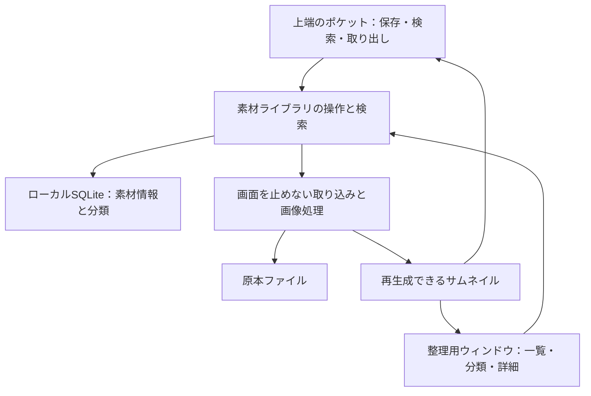

# 素材ライブラリ：Eagleを参考にした操作と応答性能の設計

ユーザー要望は、Eagleを介さずに素材を保存・整理・取り出せること、配布されたオープンソースアプリを誰でも利用できること、Eagleの軽快さと使いやすさを参考にすること。以下はそのための推奨設計と受入条件であり、素材ライブラリの実装・配布・性能達成を示すものではない。

実装範囲と受入条件の正本は[素材ライブラリ初期版の要件](../requirement/asset-library-v1.md)。ユーザー指定で動画・PDFのプレビューも初期版へ含め、素材に合わせて上端のパネル自体が拡大し、パネル内の再生・ページ移動と全画面切替を提供する。画像から始める当初案を更新した。Claude初回レビューの指摘を反映済みで、最終改訂版の再確認は利用上限のため未完了。

## 背景と根拠

現在のWindows版の `ClipboardHistoryStore` はテキスト30件・画像20件の短い履歴をJSONで保存する。画像追加時はPNGの書き込みと履歴保存を行う。これを大量の素材の保存先へ拡張すると、全件の更新や画像処理が操作の応答へ影響するため、永続的な素材ライブラリを別に設ける。

既存の「管理された機能ライブラリ」はAIが使う機能の台帳であり、この素材ライブラリとは別の機能。短いクリップボード履歴の保存件数・自動整理も素材の保存期間とは分離する。

Eagleの公式資料から、次の公開された振る舞いを参考にする。内部のDB、キャッシュ方式、スレッド構成は確認できておらず、下記の実装方式はHoverPocket側の設計判断。

| 確認できたEagleの工夫 | HoverPocketへ取り入れること | 根拠 |
| --- | --- | --- |
| Spaceキーのプレビューを、画像の完全な読み込みを待たずに表示する | 小さいプレビューを先に表示し、選択中の原寸画像へ段階的に更新する | [Eagle 4 Build2、2024-08-15](https://en.eagle.cool/blog/post/eagle4-build2) |
| タグ・フォルダ・スマートフォルダで整理する | タグ、分類フォルダ、保存した検索条件を同じ一覧へ適用する | [公式の整理機能](https://en.eagle.cool/support/desktop/organize) |
| 起動・ライブラリ読み込み・画像デコード・一覧描画・大量素材時のメモリを改善する | 初回表示、検索、画像処理、一覧の描画、メモリを別々に計測して改善する | [Eagle 4、2024-07-30](https://en.eagle.cool/blog/post/eagle4) |
| 分類フォルダ選択で階層の折りたたみと矢印キーを使える | 小さい画面でも整理できる折りたたみ式サイドバーとキーボード操作を用意する | [Eagle 4 Build2](https://en.eagle.cool/blog/post/eagle4-build2) |

上記の発表は過去の改善事例として参照する。Eagleが公表した速度比率を、HoverPocketの測定結果や達成目標として転記しない。

## 採用する構成

インストール直後から、各ユーザーの端末内にライブラリを作って使える。Windows原本は`%LOCALAPPDATA%\HoverPocket\AssetLibrary`、macOSは`~/Library/Application Support/HoverPocket/AssetLibrary`に置き、インストール・更新領域と分離する。基本機能にアカウント、APIキー、外部サーバー、Eagle、専用GPUを要求しない。WindowsとmacOSの既存シェルを維持し、保存形式と操作の意味を共通にする。

SQLiteを素材情報の正本とし、原本は通常のファイルとして保管する。アプリ内のローカル保存という用途は[SQLiteの公式説明](https://www.sqlite.org/whentouse.html)と整合する。検索用の索引とページ単位の取得を使い、変更した素材の情報だけを更新する。全件を起動時に読み込んだり、変更のたびに全件のJSONを書き直したりする方式を素材ライブラリには使わない。

初期版は任意形式のファイルの保存・検索・分類・ドラッグによる取り出しを一続きで実装し、画像・動画・PDFのプレビューを含める。共通必須形式はJPEG・PNG、MP4/H.264（AACまたは音声なし）、通常の非暗号化PDF。追加形式は各OSのデコード検証を伴って対応する。音声専用の再生、端末間同期、iPhone対応は後続段階とする。

### 原本・素材情報・キャッシュ

- 原本は元の形式のまま管理領域へコピーする。分類フォルダは素材への所属情報であり、複数へ分類しても原本を増やさない。取り込み元のファイルを移動・変更しない。
- 素材IDにはUUIDを使い、内容のSHA-256とは分ける。名前、元の拡張子、バイト数、取り込み日時、管理領域内の相対パス、タグと分類との関係を保存する。日時はUTCで保存し、表示時に端末の時刻へ変換する。実装時にSchema・移行・fixture・互換性検証を同時に定義する。
- 保存は、一時領域へのコピーとハッシュ計算、管理領域への原本確定、DBへの登録の順に行う。UIは即座に「保存中」を出し、原本と情報を確定してから「保存済み」にする。再起動で途中保存を検出・再開または整理できる記録を残す。
- 完全に同じ内容の再取り込みは既存素材を示し、必要なら分類を追加する。同名で内容が異なるファイルを上書きしない。類似画像の自動統合は初期版の対象外。
- サムネイルは再生成できるキャッシュとする。メモリとディスクに上限を設け、最近使っていないものから解放する。キャッシュの整理で原本や分類情報を削除しない。
- バックアップ・持ち出しでは原本と版番号付きのUTF-8メタデータをエクスポートする。ID、タグ、分類、日時を再取り込みできる形式を公開する。復元は既定位置の空ライブラリへ行い、既存領域は明示操作で退避して保持する。稼働中のDBファイルを単純にコピーするバックアップにはしない。

### 画面の応答を守る処理

取り込み、ハッシュ計算、サムネイル生成、原寸デコードはUIの処理から外す。処理の同時実行数を制限し、選択中の画像、見えている素材、その少し先の素材の順に優先する。大量取り込み中でもポケットの開閉と既存の道具を待たせない。

一覧は画面に見えている範囲と少量の先読みだけを保持・描画する。スクロール外のカードを使い回し、原寸画像を全件展開しない。並び順は素材IDも使って安定させ、追加保存・分類変更で選択や表示位置を飛ばさない。

Spaceプレビューは利用できるサムネイルを先に表示し、その後で原寸を読み込む。別の素材へ移ったら古い処理をキャンセルし、遅れて返った結果が新しい選択へ表示されないように素材IDと要求世代を検査する。原寸へ更新するときも表示位置・ズームを保つ。キャッシュがない場合は読み込み表示をすぐ出し、画像の初回表示と原寸の準備時間を分けて測る。

ポケットを隠した際は不要な先読み・アニメーション・監視を止める。整理用ウィンドウに表示中の素材の処理は維持する。動画の自動再生は既定オフとし、プレビューを閉じる・素材を切り替えると音と再生を止める。PDFは選択中のページと少量の先読みだけを描画する。

## UIと操作

### ポケットは「入れる・探す・取り出す」

上端へファイルをドラッグすると保存先として開く。保存中の表示と最近保存した素材をすぐ出し、タグ入力は任意にする。クリップボード画像には明示的な「ライブラリへ保存」を用意し、履歴の自動収集と永久保存を混同しない。

通常は最近の素材、お気に入り、検索、整理用ウィンドウへの入口を出す。素材を外のアプリへドラッグして取り出せる。ドラッグ中はポケットの自動閉鎖を抑え、終了・取消で通常のホバー動作へ戻す。整理画面を明示的に開いた際に検索条件と選択を引き継ぐ。

プレビューではポケットのパネル自身を素材の縦横比に合わせて拡大し、操作中は固定する。動画再生・PDFページ移動はこの拡大パネル内でも行える。全画面への切替・復帰で選択、再生位置、ページ、ズームを保持し、終了時に通常のサイズ設定とホバー動作へ戻す。別のプレビュー窓だけでこの要望を代替しない。

### 整理用ウィンドウは「一覧を中心に分類」

左に最近・すべて・未分類・お気に入り・分類フォルダ・保存した検索・ゴミ箱、中央にサムネイル一覧、右に選択した素材の情報を置く。左右の領域は折りたためる。画像の縦横比とサムネイルの大きさを調整でき、画像全体はプレビューで確認できる。

タグと分類フォルダは複数選択への一括適用に対応する。検索と絞り込み条件は画面上で見える形にし、個別に解除できる。「タグがロゴ」「過去30日」等の条件をスマートフォルダとして保存し、素材のコピーを作らず同じ一覧で使う。分類フォルダから外す操作と、素材をゴミ箱へ移す操作を区別して表示する。

| 操作 | 動作 |
| --- | --- |
| 矢印キー | 一覧の選択を移動 |
| Space | 選択中の素材をプレビュー |
| Esc | プレビューを閉じ、元の選択・スクロール位置へ戻る |
| Ctrl/Cmd + F | 素材検索へ移動 |
| Shift、Ctrl/Cmdを伴う選択 | 範囲選択・選択の追加と解除 |

ショートカットはボタンやメニューにも表示する。文字入力中にSpaceや矢印キーを素材操作へ奪わない。日本語入力、キーボードのみの利用、小さい画面を受入対象に含める。

### 保存失敗と復元

ファイル単位に保存中・完了・失敗を表示する。容量不足、アクセス拒否、取り込み元の切断、破損画像では原因と再試行を示し、他の保存や一覧操作は続けられる。破損画像も原本保存の結果とプレビュー生成の失敗を別々に扱う。

素材の削除は復元可能なゴミ箱へ移す。分類だけを外す操作では原本を削除しない。原本が見つからない場合も情報を勝手に削除せず、状態と復旧方法を示す。キャッシュ消失ではサムネイルを再生成する。削除・一括分類に「元に戻す」を用意する。

## 性能の受入条件

以下の数値は当初の設計目標であり、測定済みの結果や全端末への保証ではない。合否の測定点・件数・基準プロファイル・P95の計算方法は要件正本のAL-P01〜08を優先する。検知から最初の実描画、物理入力からの時間、アニメーション完了を分ける。大量素材でも一定のメモリ使用量に収まるかを重視する。

| シナリオ | 初期目標と測定方法 |
| --- | --- |
| 1万件の素材がある状態でのポケット操作 | 保存・画像処理を待たず応答。キャッシュありの最初の有用な表示までP95で100ms以内を目標とし、入力受付から実描画まで測る |
| ファイル名・タグの索引検索 | 1万件で可視範囲の結果表示までP95で150ms以内を目標とする |
| Spaceプレビュー | キャッシュありの画像初回表示までP95で100ms以内。原寸表示の完了時間は別に記録する |
| 1,000件の連続取り込み中 | 上端への直接移動、検索、スクロール、取消が使える。画面更新が50ms以上止まる箇所を記録し、保存・デコードによるUI停止を解消する |
| 1万件から10万件への拡大 | カード数・展開画像数・キャッシュ上限を記録し、全件数に比例して画面用メモリが増えないことを確認する |

P95は測定の95%がその値以内に収まる指標。初回起動、キャッシュなしの初回閲覧、キャッシュありの再閲覧を別に報告する。今回のWindows 0.2.9-local.6の座標注入から表示確認までの時間を、物理入力から実描画までのライブラリ性能として流用しない。

通常の内蔵GPUの端末でも検証する。WindowsとmacOSの実機受入は個別に行い、片方の成功を両方の成功とは扱わない。ログは処理件数・所要時間・メモリ量を中心にし、私的なファイル名・画像内容を性能ログへ載せない。

## 選択肢と影響

| 方式 | 判断 |
| --- | --- |
| 既存クリップボード履歴の件数を増やす | 短期履歴と永久保存の意味が混ざり、全件読み書き・画像処理の影響が大きいため採用しない |
| 原本＋ローカルSQLite＋再生成可能なキャッシュ | 推奨。アカウント不要、部分検索と更新、公開形式での持ち出しを実現できる。DBとファイルをまたぐ保存・回復の実装が必要 |
| 外部サービスを基本機能の必須条件にする | オフライン利用と導入の簡単さに合わないため、基本機能には採用しない |

同期はローカル版の受入後に設計する。前の会話で挙げたDropboxは任意同期の候補であり、確定した実装ではない。各端末が自分のDBを持ち、原本と版管理した変更を同期する。稼働中のDBを複数端末の共有フォルダで直接使わない。SQLiteのWALも[同一ホストを要求する](https://www.sqlite.org/wal.html)。競合・削除の伝播・復元・認証・オフライン再試行は同期段階の契約とする。iPhoneからの共有もその後の独立した受入を設ける。

## 実装順と完了判定

1. 原本保存・DB登録・再起動時の回復、ゴミ箱とエクスポートの契約を定義し、Schema・移行・fixtureと一緒に実装する。
2. ポケットで保存・最近の素材の表示・ドラッグによる取り出しを一続きで使えるようにする。既存の上端開閉・クリップボード履歴・道具の保存を確認する。
3. 整理用ウィンドウへ一覧、検索、タグ、分類フォルダ、お気に入り、保存した検索条件、一括操作、画像・動画・PDFのSpaceプレビューを追加する。
4. 各OSで性能条件と、重複・同名別内容・容量不足・破損画像・保存中終了・キャッシュ消失・削除復元・エクスポート再取り込み・日本語入力を検証する。

現在は設計と要件の整理まで。素材ライブラリ用のDB、ファイル形式、画面、同期機能は未実装である。既存のAI機能台帳や短期履歴のデータ形式をこの文書だけで変更しない。
