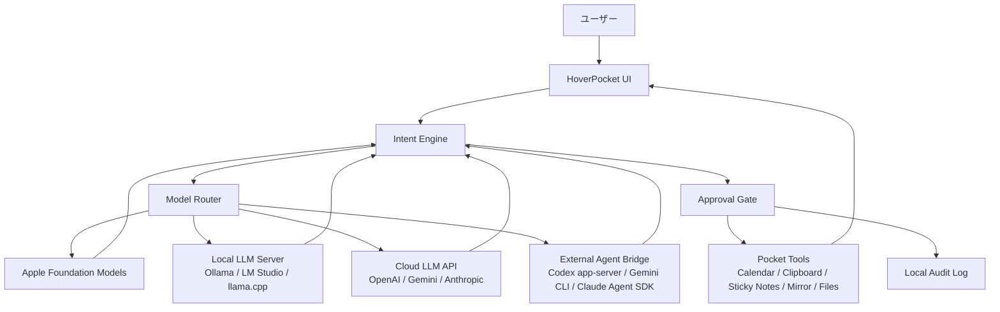

# HoverPocket AIネイティブ化: ローカルLLM / クラウドLLM アーキテクチャ調査レポート

作成日: 2026-06-10
現状追記: 2026-06-20

## 1. 結論

HoverPocket をAIネイティブなアプリに進化させる場合、最も現実的な設計は「ローカル優先のハイブリッド構成」です。

おすすめの優先順位は次の通りです。

1. Apple Foundation Models を最優先のゼロ設定ローカルAIとして使う
2. Ollama / LM Studio / llama.cpp などのローカルLLMサーバーを接続できるようにする
3. OpenAI / Gemini / Anthropic などのクラウドAPIは、高精度が必要な処理だけに限定する
4. Codex app-server / Gemini CLI / Claude Agent SDK は、一般ユーザー向けの標準機能ではなく、上級者向けの外部エージェント接続として扱う

重要な事実として、ChatGPT Plus、Claude Pro、Google AI Pro/Ultra などの個人向けサブスクは、そのまま一般アプリのLLMバックエンドとして自由に使えるものではありません。特に OpenAI API は ChatGPT サブスクとは別課金です。Anthropic は、第三者アプリが claude.ai のログインや利用枠を自社プロダクト内で提供することを、事前承認なしには認めていないと明記しています。

そのため、リリース版の基本方針は次の形が妥当です。

- 普段の軽い判断、分類、要約、Intent抽出はローカルAIで処理する
- 高精度な推論や長い計画が必要なときだけ、ユーザーが明示的にクラウドAIを選ぶ
- クラウドAIは、アプリ側課金またはユーザー持ち込みAPIキーを前提にする
- Codex / Gemini CLI / Claude Code 連携は、開発者やパワーユーザー向けの拡張機能にする

## 2. 前提

HoverPocket は、macOS の画面上部ホバーから小さなパネルを開き、Mirror、Google Calendar、Clipboard、Sticky Notes などの Provider を切り替えて使うアプリです。現在の設計では、各機能は `PocketProvider` として実装され、`ProviderRegistry` に登録されます。

2026-06-20 時点では、AI native Phase 1 として Apple Foundation Models provider、Calendar read/write tool、Approval Gate、Audit Log、パネル下部の AI command lane は実装済みです。Ollama、LM Studio、クラウド LLM、外部エージェント接続はまだ標準機能にはしていません。

AIネイティブ化では、この Provider 群を単なるUI部品として見せるのではなく、AIがユーザーの目的を解釈し、必要な Provider や Action を選び、ユーザーの確認を取りながら実行する構成に変えます。

中島聡さんが語るAIネイティブの方向性に寄せるなら、「人がアプリを開いてボタンを探す」のではなく、「人が目的を話し、AIがアプリの機能/APIを呼び出して結果を返す」形になります。

## 3. 推奨アーキテクチャ



### 3.1 AIを直接アプリの中に置かない

設計上のポイントは、LLMを直接 Provider に埋め込まないことです。

代わりに、次の層を分けます。

- `Intent Engine`: ユーザーの入力を「何をしたいか」に変換する
- `Model Router`: どのAIモデルを使うかを判断する
- `Tool Executor`: Calendar、Clipboard、Sticky Notes、Mirror などの実処理を行う
- `Approval Gate`: 削除、送信、予定作成、クリップボード書き換えなどの前に確認を取る
- `Audit Log`: AIが何を提案し、何を実行したかをローカルに記録する

この分離により、ローカルLLM、クラウドLLM、Codex系エージェントを後から差し替えられます。

## 4. ローカルLLM構成

### 4.1 Apple Foundation Models

Apple Foundation Models は、Apple Intelligence のオンデバイスモデルをアプリから使える Apple 公式フレームワークです。Apple の発表では、iOS 26、iPadOS 26、macOS 26 以降の Apple Intelligence 対応デバイスで使えます。モデルは約30億パラメータで、オフライン、プライバシー保護、APIコストなしで使えることが強調されています。

HoverPocket では、これを最初に使うべきです。理由は、ユーザーがLM StudioやOllamaを知らなくても動くからです。

向いている用途:

- ユーザー入力の分類
- Provider の選択
- 短い要約
- カレンダー予定の下書き生成
- クリップボード履歴の分類
- ローカルデータをクラウドに送る前のプライバシー判定

向いていない用途:

- 長いリサーチ
- 複雑な開発タスク
- 高度な推論
- 最新Web情報が必要な質問

設計上は、`SystemLanguageModel` の availability を確認し、使えない環境では Ollama / LM Studio にフォールバックする形がよいです。

### 4.2 Ollama

Ollama は、ローカルLLMを一般ユーザーにも扱いやすくするための実行環境です。標準では `http://localhost:11434` にAPIを立てます。公式APIには、モデル一覧を取得する `/api/tags`、モデルをダウンロードする `/api/pull`、チャットする `/api/chat` などがあります。OpenAI互換API、ツール呼び出し、構造化出力にも対応しています。

HoverPocket にとって、Ollama の大きな利点は「モデルインストール補助」をアプリ側から作りやすいことです。

想定UX:

1. 設定画面で「ローカルAIを使う」を選ぶ
2. HoverPocket が Ollama の起動状況を確認する
3. 未インストールなら、インストール導線を表示する
4. モデル未取得なら、推奨モデルを選ばせる
5. `/api/pull` でダウンロード進捗を表示する
6. ダウンロード後、自動でテスト会話を行う

一般ユーザー向けの「かんたんローカルAI」には、Ollama が最も実装しやすい候補です。

### 4.3 LM Studio

LM Studio は、GUIでモデルを検索、ダウンロード、実行できるローカルLLMアプリです。OpenAI互換APIを `http://localhost:1234/v1` で提供できます。公式ドキュメントでは、既存のOpenAIクライアントを `base_url` だけ差し替えて使えると説明されています。

また、`lms` CLI により、サーバー起動、ローカルモデル一覧、モデルロード、アンロードなども操作できます。LM Studio 0.4.0 では、非GUIデプロイ、並列リクエスト、継続バッチング、状態管理REST APIなどが追加されています。

HoverPocket にとっての位置づけは、「パワーユーザー向けの高機能ローカルAI接続」です。

想定UX:

- LM Studio が起動しているか確認する
- `http://localhost:1234/v1/models` に接続テストする
- ロード済みモデルを表示する
- モデル未ロードなら、LM Studioを開く案内または `lms` CLI 経由の補助を出す
- OpenAI互換APIとして扱う

LM Studio は非常に強力ですが、一般ユーザーが最初に触る導線としては Ollama より少し説明が必要です。

### 4.4 llama.cpp

llama.cpp は、GGUFモデルを軽量に実行するための基盤です。公式の server は OpenAI互換の Chat Completions、Responses、Embeddings、Anthropic互換 Messages API、JSON Schemaによる構造化出力、ツール呼び出し、継続バッチングなどに対応しています。

HoverPocket が完全に自前でローカルAI実行環境を持ちたい場合、llama.cpp は有力です。

ただし、次の負担があります。

- モデルファイルの配布サイズが大きい
- モデルライセンス確認が必要
- Apple Silicon / Intel / GPU / CPU の最適化差を吸収する必要がある
- App Store サンドボックスや notarization との相性を検証する必要がある

そのため、初期版では外部サーバーとして接続し、将来的に内蔵ランタイムを検討するのが現実的です。

### 4.5 MLX / MLX Swift

MLX は Apple Silicon 向けの機械学習フレームワークで、Apple が公開しています。Swift API もあり、WWDC 2025 では MLX LM を使った Apple Silicon 上の推論や Swift アプリ統合が紹介されています。

ただし、`mlx_lm.server` の公式ドキュメントは「本番用途には推奨しない」としています。したがって、現時点では研究開発や高度な最適化向けです。

HoverPocket では、将来のネイティブ最適化候補として扱うのがよいです。

## 5. クラウドLLM構成

### 5.1 OpenAI API

OpenAI の Responses API は、ツール呼び出し、function calling、remote MCP、Web検索、ファイル検索、コンピューター操作などを組み合わせられます。Agents SDK では、Agent、Tool、Guardrail、Handoff などの概念でエージェント的な処理を構成できます。

HoverPocket で使うなら、次の処理に向いています。

- 複雑な計画作成
- 長い文脈の整理
- カレンダー、クリップボード、ファイルを横断したタスク分解
- ローカルモデルで失敗したときの高精度フォールバック

ただし、OpenAI API は ChatGPT Plus / Business / Enterprise / Edu とは別課金です。OpenAI Help と API pricing では、API利用は ChatGPT サブスクに含まれず、別請求であると説明されています。

そのため、HoverPocket のリリース版で「ChatGPT PlusにログインしていればAPIコストなしで使える」という設計はできません。

現実的な選択肢は次の2つです。

- アプリ側がAPI費用を持ち、サブスクやクレジットで回収する
- ユーザーが自分のOpenAI APIキーを入れる

APIキーは macOS Keychain に保存し、アプリ本体やログに出さない設計が必要です。

### 5.2 Codex app-server

Codex app-server は、Codex をリッチクライアントに埋め込むためのローカルJSON-RPCサーバーです。公式ドキュメントでは、stdio、WebSocket、Unix socket で接続でき、Codex の thread、turn、approval、history、streamed event などを扱えると説明されています。

また、ChatGPTサインイン、APIキーサインイン、実験的なChatGPT external token、rate limit 読み取りなどの仕組みがあります。

これは非常に魅力的ですが、リリース版の標準AIエンジンとして扱うには注意が必要です。

理由:

- Codex 専用の統合方式であり、汎用OpenAI APIではない
- ユーザー側に Codex 環境が必要になる
- ChatGPT subscription の利用枠を一般アプリのLLM利用として保証するものではない
- WebSocket を非localhostで開く場合の認証など、セキュリティ設計が必要
- known client や enterprise client など、公開プロダクトとして深く統合する場合は OpenAI 側との確認が必要になる可能性がある

したがって、HoverPocket では「Codex Mode」として上級者向けにするのがよいです。

使いどころ:

- ユーザー本人が Codex を使っている環境で、HoverPocket から現在の作業文脈を渡す
- 長い開発タスクを Codex thread に投げる
- HoverPocket を Codex の control surface として使う
- ローカルファイル、承認、履歴を伴う高度なワークフローを扱う

一般ユーザー向けの標準AIとしては、Apple Foundation Models と Ollama のほうが現実的です。

### 5.3 Gemini API / Gemini CLI

Gemini API は、APIキー、Google Cloud の認証、Vertex AI などを通じて利用します。Google AI Studio / Gemini API のドキュメントでは、無料枠と従量課金が説明されています。

一方、Gemini CLI は個人のGoogleログインで使えるオープンソースAIエージェントです。公式GitHubでは、個人Googleアカウントでログインでき、無料枠として 60 requests/minute、1,000 requests/day が示されています。Gemini CLI は ReAct ループ、組み込みツール、ローカル/リモート MCP サーバーに対応しています。

これは HoverPocket にとって面白い選択肢です。

ただし、重要なのは、Gemini CLI は「CLIとしての開発者向けエージェント」であり、一般リリースアプリがGoogleログインだけでGeminiを自由にバックエンド利用できる、という意味ではありません。

現実的には次の扱いです。

- 一般ユーザー向け: Gemini APIキーまたはアプリ側課金
- パワーユーザー向け: Gemini CLI が入っている場合だけ外部エージェントとして接続

### 5.4 Claude / Claude Code / Claude Agent SDK

Claude Code は、Claude を使ったエージェント型開発CLIです。Claude Agent SDK は、Claude Code の中核機能をライブラリとして使い、本番エージェントを作るためのSDKです。Subagents、hooks、MCP、permissions、sessions などを扱えます。

ただし、Anthropic の Agent SDK ドキュメントには、事前承認がない限り、第三者開発者が claude.ai のログインや rate limit を自社製品内で提供することは許可されないと明記されています。利用する場合は API key 認証が前提になります。

また、2026-06-15 から、subscription plan 上の Agent SDK / `claude -p` 利用は、別の月次 Agent SDK credit から消費される予定であると案内されています。

したがって、HoverPocket の一般リリース版で「ユーザーのClaude Proサブスクをそのまま使う」設計は避けるべきです。

現実的な扱い:

- Claude APIキー持ち込み
- Anthropic APIをアプリ側課金で提供
- Claude Code / Agent SDK は上級者向け外部エージェント接続

## 6. ユーザー体験としての設計

### 6.1 設定画面の推奨構成

設定画面は、技術名を前面に出すより、目的別に分けるべきです。

```text
AI設定

モード:
  自動
  プライベート重視
  高精度重視
  開発者モード

ローカルAI:
  Apple内蔵AI: 使用可能 / 使用不可
  Ollama: 未検出 / 起動中 / 接続済み
  LM Studio: 未検出 / 接続済み
  カスタムOpenAI互換サーバー: base URL / model

クラウドAI:
  OpenAI APIキー
  Gemini APIキー
  Anthropic APIキー

外部エージェント:
  Codex app-server
  Gemini CLI
  Claude Agent SDK
```

一般ユーザーには、最初に「自動」を選ばせます。自動モードでは、次の順番でモデルを選びます。

1. Apple Foundation Models が使えるなら使う
2. Ollama が使えるなら使う
3. LM Studio が使えるなら使う
4. クラウドAPIキーが設定されていれば使う
5. 何もなければ、ローカルAIのセットアップウィザードを出す

### 6.2 モデルインストール補助

ローカルLLMに詳しくないユーザー向けには、モデル名を一覧で並べるだけでは不十分です。

アプリ側では、次のような表現が必要です。

- 軽いモデル: 速いが、複雑な推論は苦手
- 標準モデル: 普段使い向け
- 高精度モデル: 遅いが、文章整理や計画に強い

内部的には、Ollama の `/api/pull` や LM Studio の model management / CLI を使って補助できます。ただし、モデルライセンス、配布条件、ユーザーのストレージ容量は確認が必要です。

### 6.3 AIが楽にする体験

HoverPocket がAIネイティブになると、ユーザー体験は大きく変わります。

従来:

- ユーザーがメニューを開く
- Calendar を選ぶ
- 予定を見る
- コピー履歴を探す
- 必要なら別アプリに貼る

AIネイティブ後:

- ユーザーが「今日の予定に合わせて、次にやることを出して」と言う
- AIが Calendar と Clipboard を読み、次の行動を提案する
- 「この予定を30分後ろにずらす？」と聞く
- ユーザーが確認すると、予定変更の下書きを作る
- 実行前に確認を出し、承認後に反映する

つまり、ユーザーはアプリの機能を覚える必要が減ります。目的だけを伝えれば、AIが機能を組み合わせます。

## 7. セキュリティと承認設計

AIネイティブ化では、AIに何でも実行させると危険です。特に HoverPocket は Calendar、Clipboard、Camera、Microphone などプライバシー性の高い Provider を扱います。

必須設計:

- 読み取りと書き込みを分ける
- 書き込み、削除、送信、外部共有は必ず人間の承認を挟む
- AIに渡す前に、データ感度を判定する
- クリップボード内のパスワード、APIキー、個人情報らしき文字列はクラウド送信しない
- APIキーは Keychain に保存する
- どのモデルに何を送ったかを記録する
- ユーザーがローカルのみモードを選べるようにする

OpenAI Agents の guardrails / approvals ドキュメントでも、ファイル操作、メール送信、シェル実行、機微なMCP操作などの前に人間承認を挟む設計が示されています。HoverPocket でも同じ思想が必要です。

## 8. 実装ロードマップ

### Phase 1: AIの抽象化

- `AIModelProvider` protocol を作る
- `IntentPlan` / `PocketAction` / `ToolResult` を定義する
- 既存 Provider を Tool として呼べるようにする
- すべての書き込み系 Action に `requiresApproval` を付ける

### Phase 2: ローカルAI対応

- Apple Foundation Models adapter を作る
- Ollama adapter を作る
- LM Studio / OpenAI互換 adapter を作る
- 設定画面に接続テストを追加する
- 推奨モデルのセットアップ導線を作る

### Phase 3: クラウドAI対応

- OpenAI / Gemini / Anthropic APIキー持ち込みに対応する
- コスト表示と送信前確認を入れる
- クラウド送信禁止モードを作る
- 機密情報フィルタを入れる

### Phase 4: 外部エージェント対応

- Codex app-server bridge を developer mode として追加する
- Gemini CLI bridge を developer mode として追加する
- Claude Agent SDK bridge を API key 前提で検証する
- 各外部エージェントは標準機能ではなく、明示的に有効化する

## 9. 可否判断

| 選択肢 | 一般ユーザー向け標準機能 | 技術的可否 | コスト面 | コメント |
|---|---:|---:|---:|---|
| Apple Foundation Models | 高い | 高い | 追加APIコストなし | 対応OS/対応デバイスのみ |
| Ollama | 高い | 高い | 追加APIコストなし | インストール補助UXを作りやすい |
| LM Studio | 中 | 高い | 追加APIコストなし | パワーユーザー向けに強い |
| llama.cpp内蔵 | 中 | 中 | 追加APIコストなし | 実装と配布の負担が大きい |
| MLX内蔵 | 低〜中 | 中 | 追加APIコストなし | 将来の最適化候補 |
| OpenAI API | 中 | 高い | 従量課金 | ChatGPTサブスクとは別課金 |
| Gemini API | 中 | 高い | 無料枠/従量課金 | Googleログインだけで一般アプリ利用できる設計ではない |
| Anthropic API | 中 | 高い | 従量課金 | Claude Proの利用枠を第三者アプリに流用する設計は不可 |
| Codex app-server | 低〜中 | 中〜高 | ユーザー環境依存 | 上級者向け。標準機能にはしにくい |
| Gemini CLI | 低〜中 | 中 | 個人無料枠あり | CLI前提の開発者向け接続 |
| Claude Agent SDK | 低〜中 | 高い | API/credit前提 | 第三者アプリでclaude.aiログイン提供は要承認 |

## 10. 最終提案

HoverPocket のAIネイティブ化では、次の構成を採用するのが最も筋が良いです。

```text
標準ユーザー:
  Apple Foundation Models
  + Ollama セットアップ補助
  + LM Studio 接続

高精度が必要なユーザー:
  BYOK方式の OpenAI / Gemini / Anthropic API

開発者・パワーユーザー:
  Codex app-server
  Gemini CLI
  Claude Agent SDK
```

この構成なら、普段の体験は低コストでプライベートに保てます。クラウドAIは必要なときだけ使うため、コストが膨らみにくくなります。さらに、Codex app-server のような高度な仕組みも、ユーザーを限定すれば安全に実験できます。

一般ユーザーにとって重要なのは、「AIモデルを選ばせること」ではありません。「何も知らなくても、最初からそれなりに賢く動き、必要なときだけ丁寧に案内してくれること」です。

その意味で、HoverPocket のAI設定は「LLM設定画面」ではなく、「プライバシー、品質、コストのバランスを選ぶ画面」として設計するべきです。

## 11. 主な出典

- Apple Foundation Models: [Apple Developer Documentation](https://developer.apple.com/documentation/FoundationModels), [Apple Newsroom](https://www.apple.com/newsroom/2025/09/apples-foundation-models-framework-unlocks-new-intelligent-app-experiences/), [WWDC 2025 Meet the Foundation Models framework](https://developer.apple.com/videos/play/wwdc2025/286/)
- Ollama API: [API introduction](https://docs.ollama.com/api/introduction), [OpenAI compatibility](https://docs.ollama.com/api/openai-compatibility), [Pull model API](https://docs.ollama.com/api/pull), [Tool calling](https://docs.ollama.com/capabilities/tool-calling), [Structured outputs](https://docs.ollama.com/capabilities/structured-outputs)
- LM Studio: [OpenAI compatibility](https://lmstudio.ai/docs/developer/openai-compat), [Local server](https://lmstudio.ai/docs/developer/core/server), [CLI](https://lmstudio.ai/docs/cli), [LM Studio 0.4.0](https://lmstudio.ai/blog/0.4.0)
- llama.cpp server: [Server README](https://github.com/ggml-org/llama.cpp/blob/master/tools/server/README.md)
- MLX: [MLX GitHub](https://github.com/ml-explore/mlx), [MLX Swift](https://github.com/ml-explore/mlx-swift), [mlx-lm server](https://github.com/ml-explore/mlx-lm/blob/main/mlx_lm/SERVER.md), [WWDC 2025 Explore large language models on Apple silicon with MLX](https://developer.apple.com/videos/play/wwdc2025/298/)
- OpenAI: [Codex app-server](https://developers.openai.com/codex/app-server), [Codex glossary](https://developers.openai.com/codex/glossary), [OpenAI API pricing](https://openai.com/api/pricing/), [ChatGPT Plus help](https://help.openai.com/en/articles/6950777-what-is-chatgpt-plus), [ChatGPT/API billing separation](https://help.openai.com/en/articles/9039756-managing-billing-settings-on-chatgpt-web-and-platform)
- Gemini: [Gemini API key](https://ai.google.dev/gemini-api/docs/api-key), [Gemini API billing](https://ai.google.dev/gemini-api/docs/billing), [Gemini API pricing](https://ai.google.dev/gemini-api/docs/pricing), [Gemini CLI GitHub](https://github.com/google-gemini/gemini-cli), [Gemini CLI authentication](https://google-gemini.github.io/gemini-cli/docs/get-started/authentication.html), [Gemini CLI on Google Cloud](https://docs.cloud.google.com/gemini/docs/codeassist/gemini-cli)
- Anthropic: [Claude Code authentication](https://code.claude.com/docs/en/authentication), [Claude Agent SDK overview](https://code.claude.com/docs/en/agent-sdk/overview), [Claude pricing](https://platform.claude.com/docs/en/about-claude/pricing), [Anthropic Agent SDK announcement](https://www.anthropic.com/news/enabling-claude-code-to-work-more-autonomously)

## 12. 用語補足

- LLM: 大規模言語モデル。ChatGPT、Claude、Gemini、Llama などの文章や推論を扱うAIモデル。
- ローカルLLM: ユーザーのMacやPC上で動くLLM。API費用がかからず、データを外に出しにくい。
- クラウドLLM: OpenAI、Google、Anthropic などのサーバー上で動くLLM。高性能だが、通信と課金が発生する。
- BYOK: Bring Your Own Key。ユーザーが自分のAPIキーをアプリに設定する方式。
- Tool calling: AIがアプリの関数やAPIを呼び出す仕組み。
- Agent: AIが目標を理解し、必要な道具を選び、複数ステップで作業する仕組み。
- MCP: Model Context Protocol。AIエージェントが外部ツールやデータに接続するためのプロトコル。
- OpenAI互換API: OpenAIのAPI形式に似せたローカル/外部サーバーAPI。LM Studio、Ollama、llama.cpp などが対応している。
